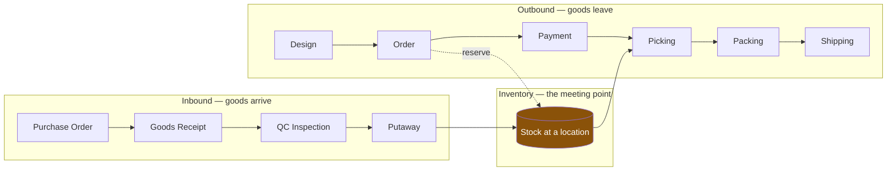

# Business Design — StockFlowCommerce

| | |
|---|---|
| **Project** | FA26SE029 — GFA26SE03 |
| **Version** | 1.0 — 2026-09-07 |
| **Feeds** | Report 3 (SRS), Report 4 (Software Design Documentation) |
| **Source** | BRD section 6.1, WBS section 3 (20 groups / 133 functions / 392 leaf tasks) |

## What this document is for

Three questions that five people working in parallel will otherwise answer differently:

1. **Who owns which data** — and what happens when another service needs it.
2. **What states an entity can be in** — and who is allowed to move it between them.
3. **What travels between services** — which event, carrying what, triggering which transition.

Every state in this document is traceable to a WBS item. Where the WBS names a status
explicitly, that name is kept even when a different one would read better — matching the
capstone report matters more than elegance.

## Reading order

| File | Contents |
|---|---|
| `01-ubiquitous-language.md` | The eleven terms the team must not use loosely |
| `02-data-ownership.md` | Which service owns which entity; what is replicated and why |
| `03-state-machines.md` | Thirteen state machines with transition tables and guards |
| `04-data-flows.md` | Four end-to-end flows: inbound, outbound, transfer, return |
| `04b-storage-per-step.md` | The same four flows seen as storage: which table in which database each step writes |
| `04c-all-flows.md` | All 25 flows — main, secondary, exception and platform — with diagrams and per-step writes |
| `05-business-rules.md` | The BR catalog: rule, owner, enforcement point, test hook |
| `06-open-questions.md` | Decisions the team still has to make, with a recommendation each |

## The one diagram that frames everything else

Inventory is the single point where the warehouse half and the commerce half of the platform
meet. Everything else in this document exists to keep that number correct.
