# State Machines

Thirteen machines. For each: the diagram, then a transition table giving the **trigger**, the
**actor allowed to fire it**, the **guard** that must hold, and the **event emitted**.

Rules that apply to every machine on this page:

- A transition not listed is **forbidden**, and the aggregate must reject it — not the controller.
- Terminal states are marked. Nothing leaves them; a correction creates a new document.
- Every transition that other services care about emits an event. If no event is listed, the
  transition is private to the owning service.
- Guards are business rules and carry a `BR-` id from `05-business-rules.md`.

---

## 1. Product — `product-service`

WBS 3.1.1.3 (Draft → Pending → Approved), 3.1.8.1 (discontinuation).

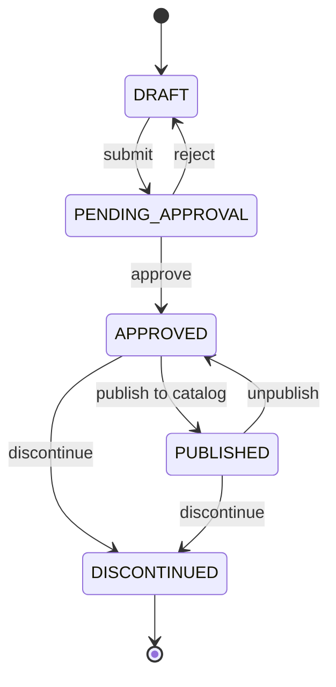

| From | To | Trigger | Actor | Guard | Event |
|---|---|---|---|---|---|
| — | DRAFT | create | E-commerce admin | SKU unique (BR-PRD-002) | — |
| DRAFT | PENDING_APPROVAL | submit | E-commerce admin | all mandatory fields present (BR-PRD-001) | — |
| PENDING_APPROVAL | APPROVED | approve | E-commerce admin (approver) | approver ≠ submitter (BR-PRD-003) | `ProductApproved` |
| PENDING_APPROVAL | DRAFT | reject | E-commerce admin (approver) | rejection reason given | — |
| APPROVED | PUBLISHED | publish | E-commerce admin | has price, image, category (BR-PRD-004) | `ProductPublished` |
| PUBLISHED | APPROVED | unpublish | E-commerce admin | — | `ProductUnpublished` |
| APPROVED / PUBLISHED | DISCONTINUED | discontinue | E-commerce admin | no open PO and no unshipped order line (BR-PRD-005) | `ProductDiscontinued` |

**DISCONTINUED is terminal.** Existing stock stays sellable-through but nothing new is ordered.

---

## 2. Purchase Order — `procurement-service`

WBS 3.2.4.3 names `Draft → Confirmed → Received → Closed`; approval (3.2.2) and amendment
(3.2.5) add the states between.

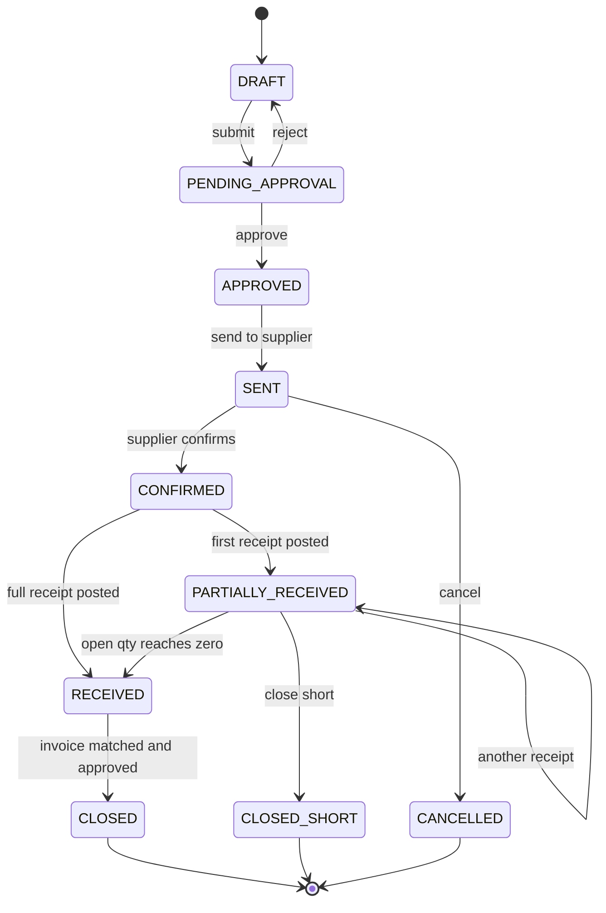

| From | To | Trigger | Actor | Guard | Event |
|---|---|---|---|---|---|
| — | DRAFT | create | Procurement staff | supplier active, ≥1 line | — |
| DRAFT | PENDING_APPROVAL | submit | Procurement staff | total ≥ 0, MOQ respected (BR-PO-001) | — |
| PENDING_APPROVAL | APPROVED | approve | approver per threshold | approver's limit ≥ PO total (BR-PO-002) | `PurchaseOrderApproved` |
| PENDING_APPROVAL | DRAFT | reject | approver | reason given | — |
| APPROVED | SENT | send | Procurement staff | supplier has email or API endpoint | `PurchaseOrderSent` |
| SENT | CONFIRMED | supplier confirms | Procurement staff (records it) | — | `PurchaseOrderConfirmed` |
| SENT | CANCELLED | cancel | Procurement staff | nothing received yet | `PurchaseOrderCancelled` |
| CONFIRMED / PARTIALLY_RECEIVED | PARTIALLY_RECEIVED | receipt posted | system | receipt total < ordered | — |
| CONFIRMED / PARTIALLY_RECEIVED | RECEIVED | receipt posted | system | open qty = 0, within over-receipt tolerance (BR-RCP-001) | `PurchaseOrderFullyReceived` |
| PARTIALLY_RECEIVED | CLOSED_SHORT | close short | Procurement staff | reason given; remaining qty written off | `PurchaseOrderClosedShort` |
| RECEIVED | CLOSED | invoice approved | Accountant | three-way match passed or override approved (BR-INV-003) | `PurchaseOrderClosed` |

**Amendment (WBS 3.2.5)** is not a state. Amending a PO in `SENT` or later creates
**revision n+1** of the same PO number and emits `PurchaseOrderAmended`; the previous revision is
retained for the audit trail. Amendment is forbidden once any receipt exists (BR-PO-004).

---

## 3. Goods Receipt — `procurement-service`

WBS 3.3.5.2 names the inventory outcome `Inbound → Available/Quarantine`; 3.3.4.4 adds RTV.

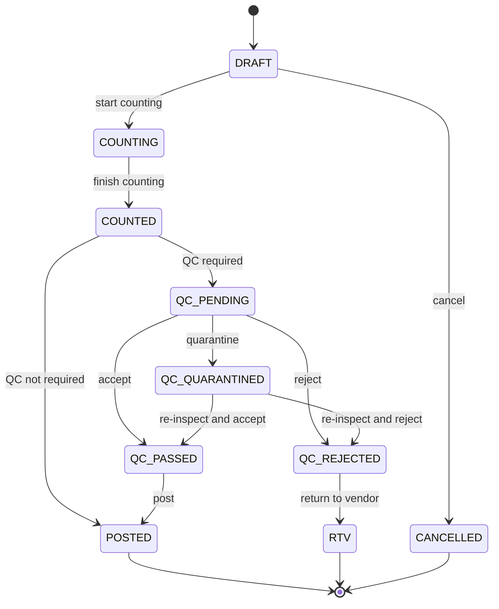

| From | To | Trigger | Actor | Guard | Event |
|---|---|---|---|---|---|
| — | DRAFT | create from PO, or blind | Warehouse staff | PO in CONFIRMED/PARTIALLY_RECEIVED, or blind receipt allowed (BR-RCP-002) | — |
| DRAFT | COUNTING | start | Warehouse staff | — | — |
| COUNTING | COUNTED | finish | Warehouse staff | every line counted; lot/expiry captured where the SKU requires it (BR-RCP-003) | — |
| COUNTED | QC_PENDING | — | system | product flagged QC-required | `QcTaskCreated` |
| COUNTED | POSTED | post | Warehouse staff | over-receipt within tolerance, else manager approval (BR-RCP-001) | `GoodsReceived` |
| QC_PENDING | QC_PASSED | accept | QC staff | — | `QcCompleted(ACCEPTED)` |
| QC_PENDING | QC_QUARANTINED | quarantine | QC staff | reason given | `QcCompleted(QUARANTINED)` |
| QC_PENDING | QC_REJECTED | reject | QC staff | reason given | `QcCompleted(REJECTED)` |
| QC_PASSED | POSTED | post | Warehouse staff | — | `GoodsReceived` |
| QC_REJECTED | RTV | return to vendor | Procurement staff | supplier notified | `ReturnToVendorRaised` |

**What `POSTED` does to inventory.** It is the only transition here that changes stock. It
creates stock rows in condition **GOOD** when QC passed or was not required, and condition
**QUARANTINE** when QC quarantined them. Quarantined stock is physically present and counted in
on-hand, but excluded from ATP — see machine 5.

---

## 4. Supplier Invoice — `procurement-service`

WBS 3.4.3 (three-way match), 3.4.4 (exceptions), 3.4.5.2 (Pending/Paid).

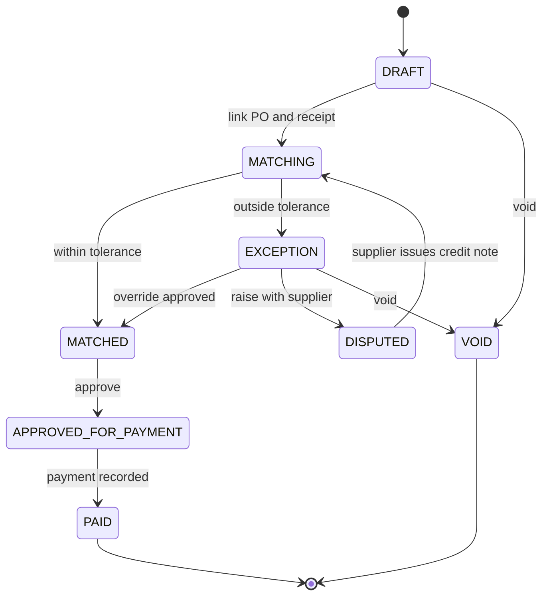

| From | To | Trigger | Actor | Guard | Event |
|---|---|---|---|---|---|
| — | DRAFT | enter invoice | Accountant | supplier invoice number unique per supplier (BR-INV-001) | — |
| DRAFT | MATCHING | link | Accountant | at least one PO and one receipt linked | — |
| MATCHING | MATCHED | auto | system | qty and price within tolerance (BR-INV-002) | `InvoiceMatched` |
| MATCHING | EXCEPTION | auto | system | outside tolerance | `InvoiceMatchException` |
| EXCEPTION | MATCHED | override | Accountant with approval limit | approver's limit ≥ variance (BR-INV-003) | `InvoiceOverrideApproved` |
| EXCEPTION | DISPUTED | dispute | Accountant | reason recorded | — |
| DISPUTED | MATCHING | credit note posted | Accountant | credit note linked | — |
| MATCHED | APPROVED_FOR_PAYMENT | approve | Accountant | within payment approval limit | `InvoiceApprovedForPayment` |
| APPROVED_FOR_PAYMENT | PAID | record payment | Accountant | — | `SupplierInvoicePaid` |

---

## 5. Stock condition — `inventory-service`

This machine governs the **condition** dimension only. Quantities (on hand / reserved /
allocated) are numbers on the same record, not states — see `01-ubiquitous-language.md`.

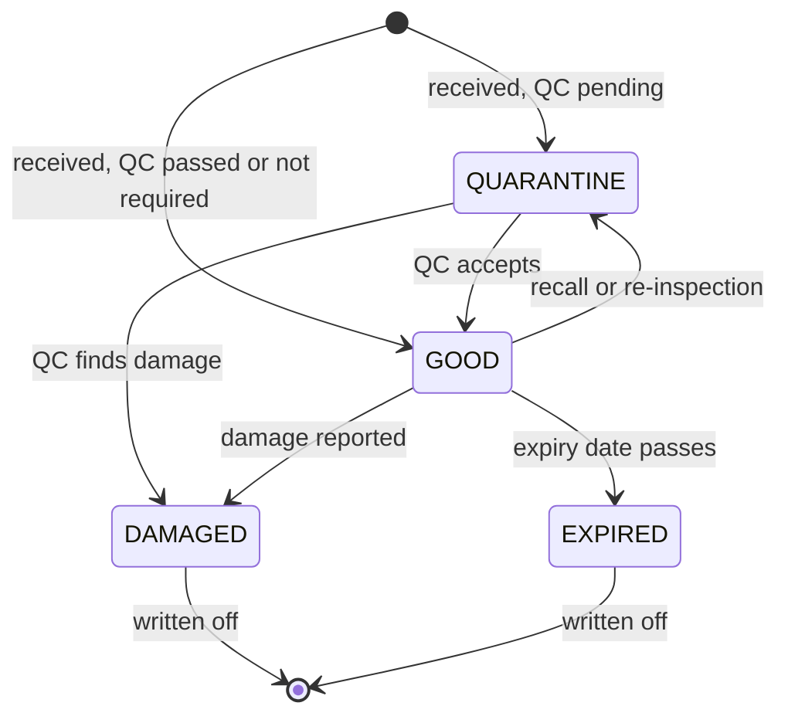

| From | To | Trigger | Actor | Guard | Event |
|---|---|---|---|---|---|
| — | GOOD | receipt posted | system | QC passed or not required | `StockReceived` |
| — | QUARANTINE | receipt posted | system | QC quarantined | `StockReceived` |
| QUARANTINE | GOOD | release | QC staff | inspection recorded | `StockReleasedFromQuarantine` |
| QUARANTINE / GOOD | DAMAGED | report damage | Warehouse staff | reason and photo (BR-STK-003) | `StockBlocked(DAMAGED)` |
| GOOD | EXPIRED | nightly sweep | system | `expiry_date < today` (BR-STK-004) | `StockBlocked(EXPIRED)` |
| GOOD | QUARANTINE | recall | Warehouse manager | reason given | `StockBlocked(QUARANTINE)` |
| DAMAGED / EXPIRED | written off | write-off | Warehouse manager | approved adjustment (BR-STK-005) | `StockWrittenOff` |

**Only GOOD counts towards ATP.** That single sentence is the reason this dimension is separate
from the quantity buckets: quarantined stock is on hand, occupies its bin, appears in a physical
count, and is invisible to the storefront.

**Reserved stock whose condition turns bad.** If GOOD stock with an outstanding reservation moves
to DAMAGED or EXPIRED, the reservation is *not* silently dropped — `inventory-service` emits
`ReservationImpaired`, and `order-service` puts the order on hold with reason
`INVENTORY_ISSUE` (WBS 3.17.6.1). Dropping it quietly is how a paid order never ships.

---

## 6. Stock reservation — `inventory-service`

WBS 3.14.5.1 (time-limited) and 3.14.5.2 (expiry and auto-release).

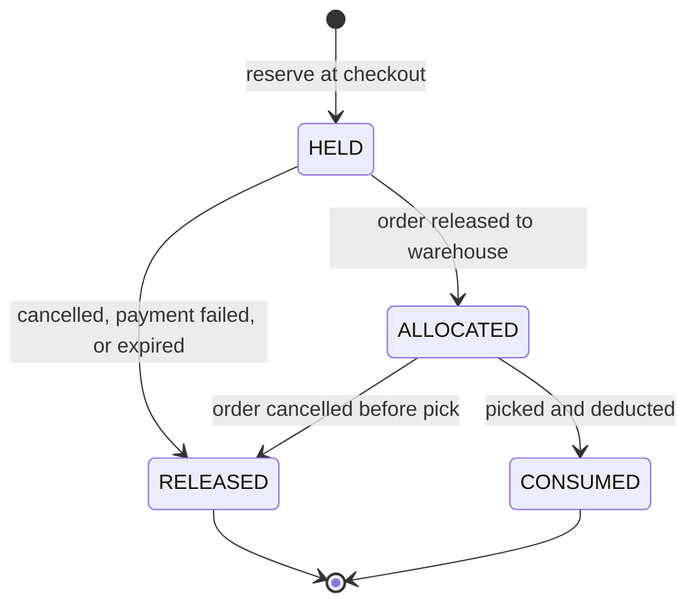

| From | To | Trigger | Actor | Guard | Event |
|---|---|---|---|---|---|
| — | HELD | reserve | system, at checkout | ATP ≥ requested (BR-STK-001) | `StockReserved` |
| HELD | RELEASED | expiry sweep | system | `expires_at < now` (BR-STK-002) | `StockReservationReleased(RESERVATION_EXPIRED)` |
| HELD | RELEASED | payment failed | system | — | `StockReservationReleased(PAYMENT_FAILED)` |
| HELD | RELEASED | customer cancels | Customer / Sales staff | order not yet released | `StockReservationReleased(ORDER_CANCELLED)` |
| HELD | ALLOCATED | order released | Order coordinator | a location and lot chosen by FEFO (BR-STK-006) | `StockAllocated` |
| ALLOCATED | CONSUMED | pick confirmed | Warehouse staff | picked qty = allocated qty | `StockDeducted` |
| ALLOCATED | RELEASED | cancel after allocation | Order coordinator | not yet picked; put-back task raised (WBS 3.7.7.2) | `StockReservationReleased(ORDER_CANCELLED)` |

**The reservation clock is the most under-specified part of the BRD.** WBS 3.14.5.1 says
"time-limited" without saying how long. See `06-open-questions.md`, OQ-03.

---

## 7. Putaway task — `warehouse-service`

WBS 3.3.6 (generation), 3.5.4 (management).

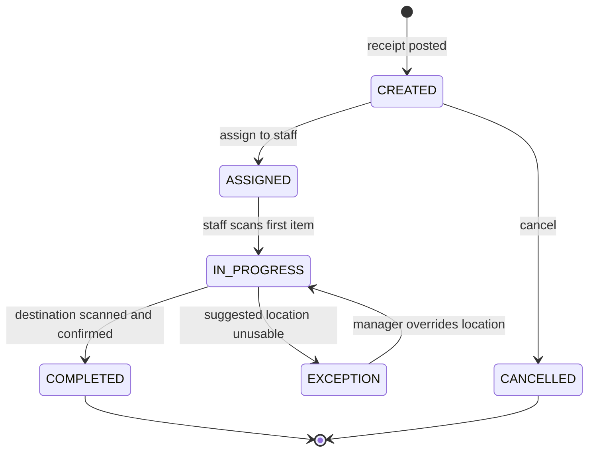

| From | To | Trigger | Actor | Guard | Event |
|---|---|---|---|---|---|
| — | CREATED | receipt posted | system | slotting engine returns ≥1 suggestion (BR-SLT-001) | `PutawayTaskCreated` |
| CREATED | ASSIGNED | assign | Warehouse manager, or auto | staff assigned to that warehouse | — |
| ASSIGNED | IN_PROGRESS | scan item | Warehouse staff | scanned SKU matches the task | — |
| IN_PROGRESS | COMPLETED | confirm location | Warehouse staff | scanned location = suggested, or override approved (BR-SLT-002) | `PutawayCompleted` |
| IN_PROGRESS | EXCEPTION | report blocked | Warehouse staff | reason given | — |
| EXCEPTION | IN_PROGRESS | override | Warehouse manager | new location passes hard constraints (BR-SLT-003) | — |

`PutawayCompleted` is what moves stock from the receiving dock to a real bin. Until then, the
stock exists with a location code of the inbound staging area and is **not** pickable.

---

## 8. Design snapshot — `design-service`

WBS 3.12.5 (immutable artifact), 3.12.4 (preflight), 3.8.3 (verification at packing).

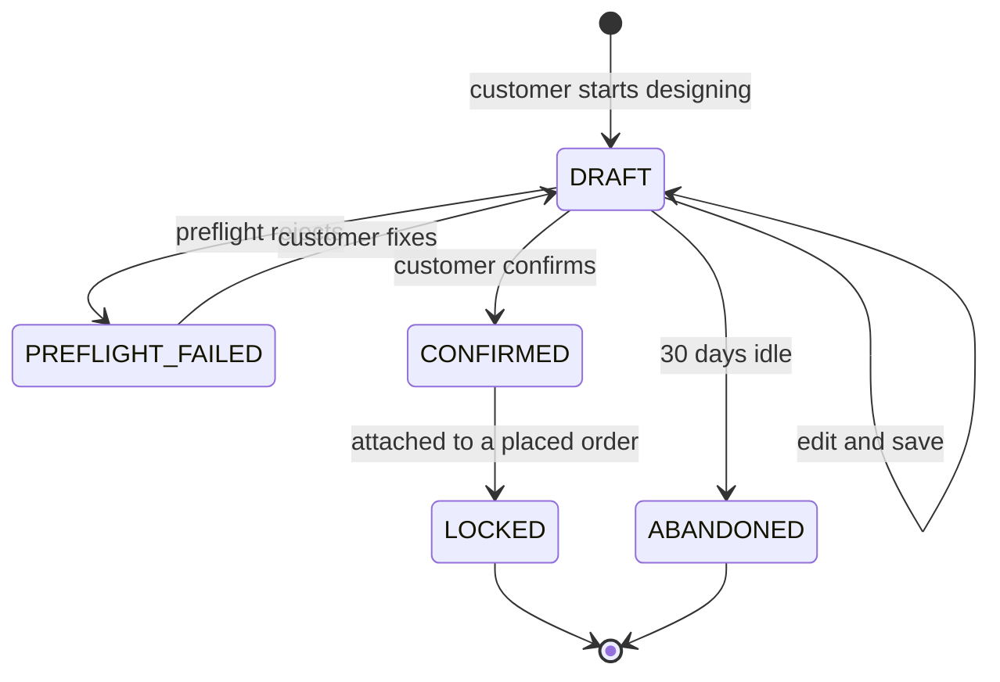

| From | To | Trigger | Actor | Guard | Event |
|---|---|---|---|---|---|
| — | DRAFT | open the studio | Customer / Sales staff | SKU has a print configuration | — |
| DRAFT | PREFLIGHT_FAILED | confirm attempted | system | DPI, bleed, safe area or colour mode fails (BR-DSG-001) | — |
| DRAFT | CONFIRMED | confirm | Customer / Sales staff | preflight passed | `DesignConfirmed` |
| CONFIRMED | LOCKED | order placed | system | order line references this snapshot | — |
| DRAFT | ABANDONED | idle sweep | system | untouched 30 days and not on an order | — |

**A CONFIRMED snapshot is never edited.** "Changing the design" creates a **new snapshot** and
re-points the order line, which is allowed only while the order is in `PENDING_PAYMENT` or
`CONFIRMED` (BR-DSG-002). After that the print file may already be at the press.

The checksum stored on the order line is compared again at packing (WBS 3.8.3). A mismatch is not
a warning — it stops the pack and raises an exception, because it means the parcel does not
contain what the customer approved.

---

## 9. Order — `order-service`

The central machine. WBS 3.17.1.1 spells it out:
`Pending Payment → Confirmed → Ready to Fulfill → In Production → Picking → Packed → Shipped →
Delivered → Completed/Cancelled`. Hold (3.17.6) and RMA (3.17.5) attach to it.

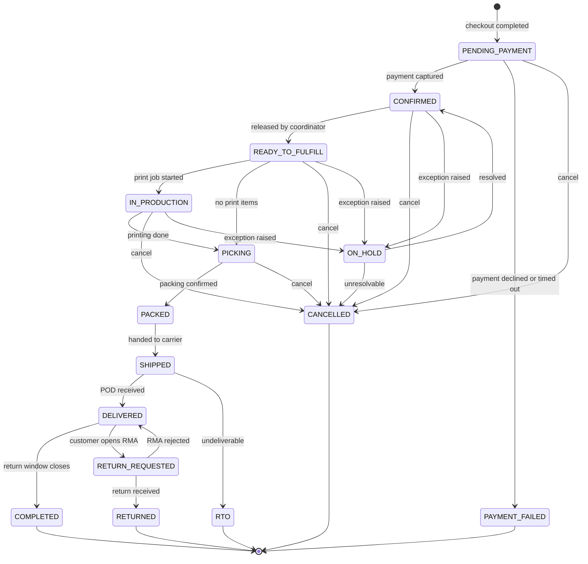

| From | To | Trigger | Actor | Guard | Event |
|---|---|---|---|---|---|
| — | PENDING_PAYMENT | checkout | Customer / Sales staff | every line reserved (BR-ORD-001) | `OrderPlaced` |
| PENDING_PAYMENT | CONFIRMED | payment captured | system | amount = order total, or deposit rule met (BR-PAY-002) | `OrderConfirmed` |
| PENDING_PAYMENT | PAYMENT_FAILED | declined or timed out | system | reservations released first | `OrderPaymentFailed` |
| CONFIRMED | READY_TO_FULFILL | release | Order coordinator | fulfilling warehouse chosen; stock allocated (BR-ORD-002) | `OrderReleased` |
| READY_TO_FULFILL | IN_PRODUCTION | start print job | Warehouse staff | order has ≥1 print line with a LOCKED snapshot | `ProductionStarted` |
| READY_TO_FULFILL | PICKING | pick list generated | system | no print lines | `PickListGenerated` |
| IN_PRODUCTION | PICKING | printing done | Warehouse staff | printed qty = ordered qty | `PickListGenerated` |
| PICKING | PACKED | packing confirmed | Warehouse staff | every line picked; design checksums match (BR-DSG-003) | `OrderPacked` |
| PACKED | SHIPPED | handover | Warehouse staff | manifest signed by carrier | `ShipmentDispatched` |
| SHIPPED | DELIVERED | POD received | system, via carrier webhook | POD payload valid | `OrderDelivered` |
| SHIPPED | RTO | undeliverable | system, via carrier webhook | carrier reports RTO | `OrderReturnedToOrigin` |
| DELIVERED | COMPLETED | window closes | system | 7 days after delivery, no open RMA (BR-ORD-005) | `OrderCompleted` |
| DELIVERED | RETURN_REQUESTED | open RMA | Customer / Sales staff | within return window | `RmaRequested` |
| any of PENDING_PAYMENT…PICKING | CANCELLED | cancel | see below | see BR-ORD-003 | `OrderCancelled` |
| CONFIRMED / READY_TO_FULFILL / IN_PRODUCTION | ON_HOLD | raise exception | Order coordinator, or system | reason is one of PAYMENT / ADDRESS / INVENTORY (WBS 3.17.6.1) | `OrderPutOnHold` |
| ON_HOLD | CONFIRMED | resolve | Order coordinator | resolution note recorded | `OrderHoldResolved` |

### Who may cancel, and until when

WBS 3.17.4.1 says the customer may cancel "before shipment". That is too loose to implement —
cancelling during `IN_PRODUCTION` means a cup has already been printed with the customer's
artwork and cannot be resold.

| Order state | Customer may cancel | Sales/coordinator may cancel | Consequence |
|---|---|---|---|
| PENDING_PAYMENT | yes | yes | release reservations |
| CONFIRMED | yes | yes | release reservations, refund in full |
| READY_TO_FULFILL | no — must request | yes | release allocations, raise put-back task |
| IN_PRODUCTION | no — must request | yes, with reason | printed items are **not refunded** (BR-ORD-004) |
| PICKING | no | yes, with reason | put-back task (WBS 3.7.7.2) |
| PACKED and later | no | no — must go through RMA | — |

### Order-line status

Order lines carry their own status, because a partially shortable order is normal.

`PENDING → ALLOCATED → PICKED → SHORT → PACKED → SHIPPED → RETURNED`

A line goes `SHORT` when the picker cannot find the allocated quantity (WBS 3.7.5). The order
does **not** fail — it goes `ON_HOLD` with reason `INVENTORY_ISSUE`, and the coordinator either
re-allocates from another location or splits the order.

---

## 10. Payment — `payment-service`

WBS 3.15. Covers gateway, bank transfer, COD, deposit, refund.

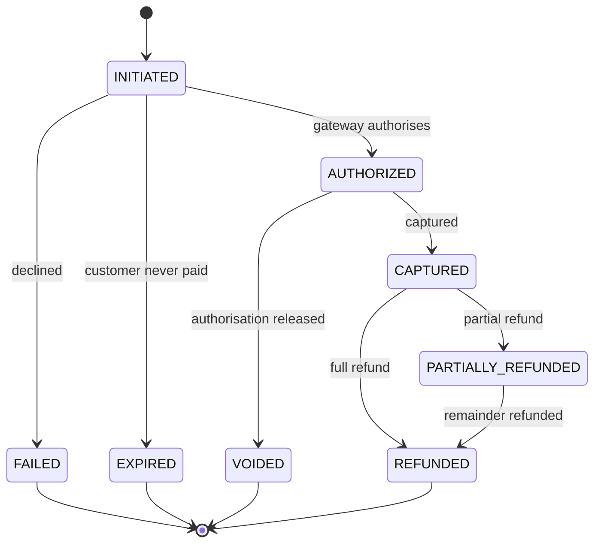

| From | To | Trigger | Actor | Guard | Event |
|---|---|---|---|---|---|
| — | INITIATED | checkout | system | order in PENDING_PAYMENT | `PaymentInitiated` |
| INITIATED | AUTHORIZED | gateway callback | system | signature valid (BR-PAY-001) | — |
| INITIATED | FAILED | gateway callback | system | — | `PaymentFailed` |
| INITIATED | EXPIRED | timeout sweep | system | unpaid past the window | `PaymentFailed` |
| AUTHORIZED | CAPTURED | capture | system, or Accountant for bank transfer | amount ≤ authorised | `PaymentCaptured` |
| CAPTURED | PARTIALLY_REFUNDED / REFUNDED | refund | Accountant | within refund approval limit (BR-PAY-003) | `RefundCompleted` |

**COD is not a payment until the carrier remits.** A COD order is `CONFIRMED` with a payment in
`INITIATED`; it becomes `CAPTURED` only at reconciliation, after the carrier hands the cash over
(WBS 3.15.4). Treating COD as paid at checkout is how the books stop balancing.

**A deposit is a payment for part of the total.** The order moves to `CONFIRMED` when
`sum(captured) ≥ deposit_required` (BR-PAY-002), not when it equals the order total.

---

## 11. Shipment — `fulfillment-service`

WBS 3.9.

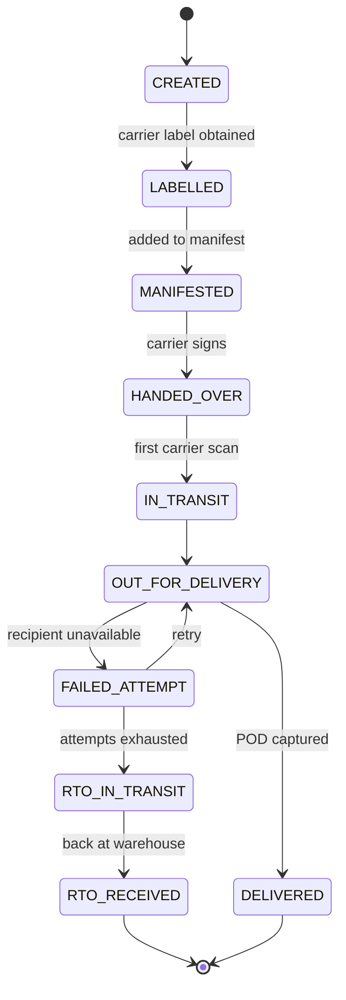

Carrier statuses are normalised into this machine (WBS 3.9.5.2) — every carrier names them
differently, and the rest of the platform must never see a carrier's vocabulary.

`RTO_RECEIVED` triggers a **re-putaway** (WBS 3.9.7.2): the goods return to stock through the
same putaway machine, in condition GOOD if the parcel is intact and QUARANTINE otherwise.

---

## 12. RMA — `order-service`

WBS 3.17.5.

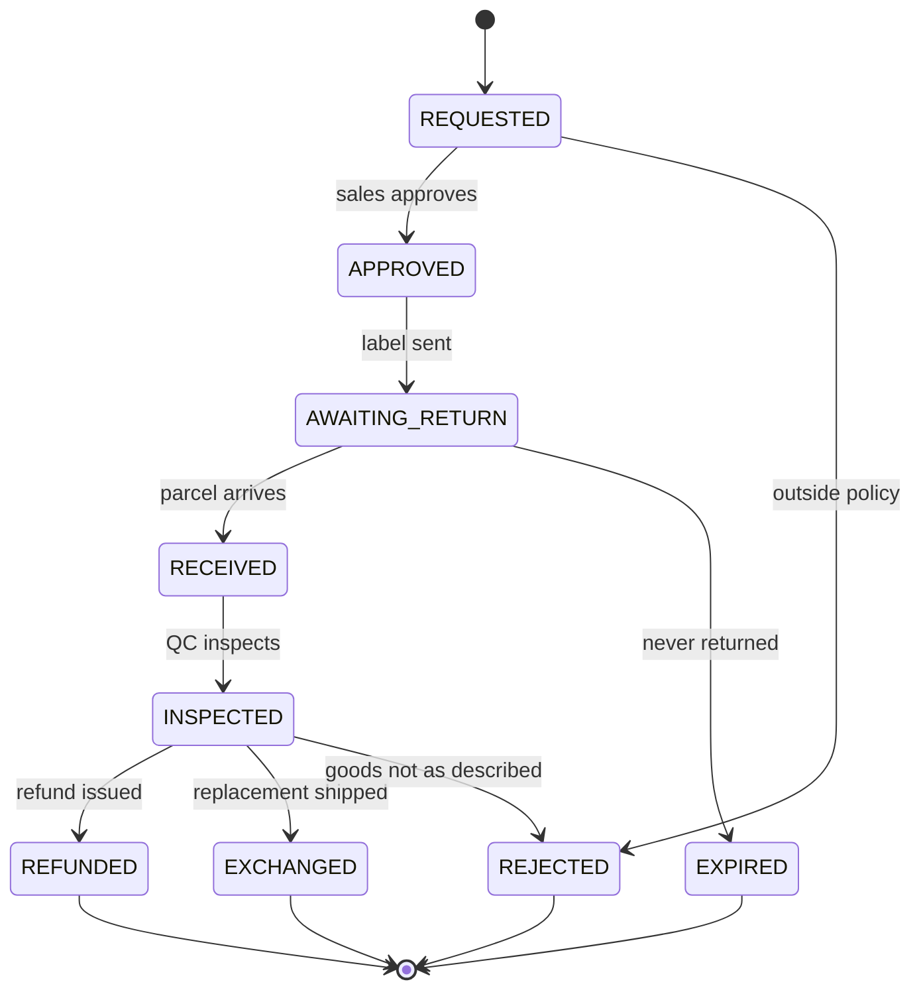

| From | To | Trigger | Actor | Guard | Event |
|---|---|---|---|---|---|
| — | REQUESTED | open RMA | Customer / Sales staff | order DELIVERED, within window (BR-RMA-001) | `RmaRequested` |
| REQUESTED | APPROVED | approve | Sales staff | reason in policy; **custom-printed items are not returnable unless defective** (BR-RMA-002) | `RmaApproved` |
| APPROVED | AWAITING_RETURN | send label | system | return label generated | — |
| AWAITING_RETURN | RECEIVED | parcel arrives | Warehouse staff | RMA number on parcel | `RmaGoodsReceived` |
| RECEIVED | INSPECTED | inspect | QC staff | condition recorded | `RmaInspected` |
| INSPECTED | REFUNDED | refund | Accountant | within refund limit | `RefundCompleted` |
| INSPECTED | EXCHANGED | ship replacement | Order coordinator | replacement stock available | `ExchangeShipped` |

Returned goods re-enter stock in condition **QUARANTINE**, never GOOD. Whether they become
sellable again is a QC decision, not an automatic one.

---

## 13. Transfer order — `inventory-service`

WBS 3.10.

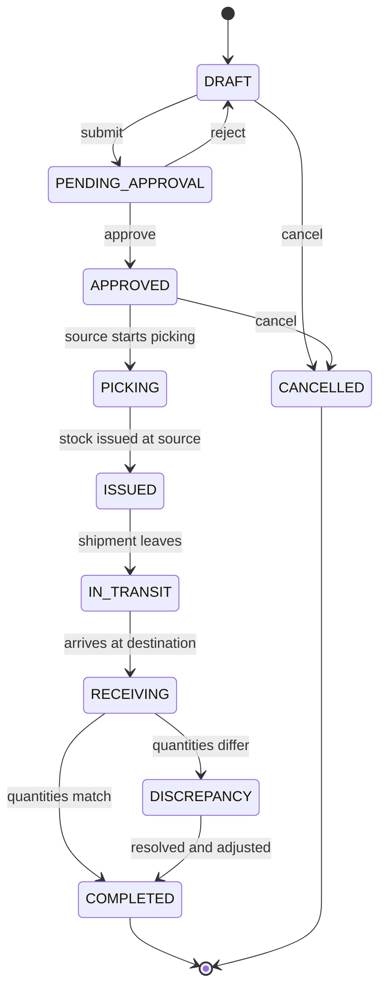

| From | To | Trigger | Actor | Guard | Event |
|---|---|---|---|---|---|
| — | DRAFT | create | Inventory planner | source ≠ destination | — |
| DRAFT | PENDING_APPROVAL | submit | Inventory planner | source ATP ≥ requested | — |
| PENDING_APPROVAL | APPROVED | approve | Warehouse manager | value within approval threshold (BR-TRF-001) | `TransferApproved` |
| APPROVED | PICKING | start | Warehouse staff | stock reserved at source, FEFO (WBS 3.10.3.2) | `TransferPickStarted` |
| PICKING | ISSUED | issue | Warehouse staff | picked = approved qty | `TransferIssued` |
| ISSUED | IN_TRANSIT | dispatch | Warehouse staff | — | `TransferInTransit` |
| IN_TRANSIT | RECEIVING | arrival | Warehouse staff (destination) | — | — |
| RECEIVING | COMPLETED | confirm | Warehouse staff | received = issued | `TransferCompleted` |
| RECEIVING | DISCREPANCY | confirm with variance | Warehouse staff | variance logged (WBS 3.10.6.1) | `TransferDiscrepancyRaised` |
| DISCREPANCY | COMPLETED | resolve | Warehouse manager | write-off approved (WBS 3.10.6.3) | `TransferCompleted` |

**In-transit stock belongs to neither warehouse's on-hand.** Between `ISSUED` and `COMPLETED` the
units sit in a dedicated in-transit bucket. Leaving them on the source's on-hand lets the source
oversell them; adding them to the destination early lets the destination sell goods that are on a
truck. This is the single most common transfer bug.

---

## 14. Cycle count — `inventory-service`

WBS 3.6.6.

`PLANNED → COUNTING → VARIANCE_REVIEW → APPROVED → POSTED`, plus `CANCELLED` from PLANNED.

A count with zero variance may skip `VARIANCE_REVIEW` and post directly. Any variance needs
manager approval (WBS 3.6.5.2) before it touches stock — a cycle count is the one place where an
unapproved number can silently rewrite inventory.

---

## 15. Chat conversation — `chat-service`

WBS 3.16.2.2 names the states: `OPEN → RESOLVED`, with `ESCALATED` in between.

`OPEN → ASSIGNED → RESOLVED`, `ASSIGNED → ESCALATED → ASSIGNED`, `RESOLVED → OPEN` on a customer
reply within 24 hours. SLA timers (WBS 3.16.6) run on `OPEN` and `ESCALATED` only.
