# State Machines

Eighteen machines. For each: the diagram, then a transition table giving the **trigger**, the
**actor allowed to fire it**, the **guard** that must hold, and the **event emitted**.

Rules that apply to every machine on this page:

- A transition not listed is **forbidden**, and the aggregate must reject it — not the controller.
- Terminal states are marked. Nothing leaves them; a correction creates a new document.
- Every transition that other services care about emits an event. If no event is listed, the
  transition is private to the owning service.
- Guards are business rules and carry a `BR-` id from `05-business-rules.md`.

---

## 1. Product — `product-service`

WBS 3.1.1.3 (Draft → Pending → Approved), 3.1.8.1 (discontinuation).

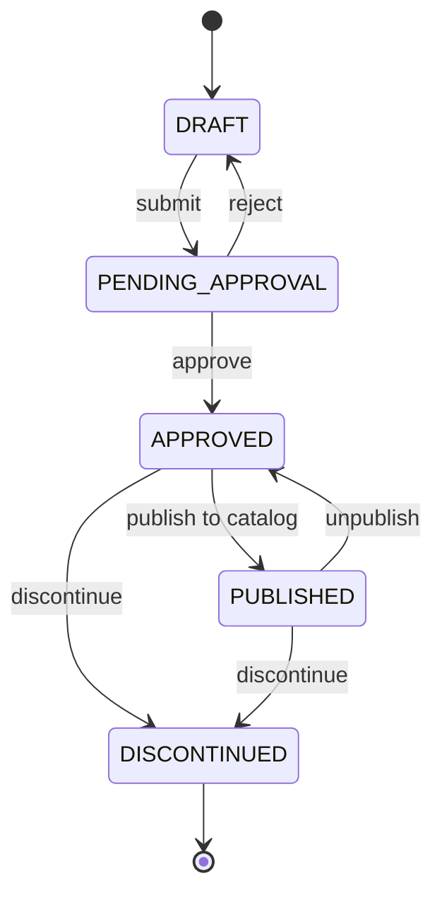
```mermaid
stateDiagram-v2
    [*] --> DRAFT
    DRAFT --> PENDING_APPROVAL: submit
    PENDING_APPROVAL --> DRAFT: reject
    PENDING_APPROVAL --> APPROVED: approve
    APPROVED --> PUBLISHED: publish to catalog
    PUBLISHED --> APPROVED: unpublish
    APPROVED --> DISCONTINUED: discontinue
    PUBLISHED --> DISCONTINUED: discontinue
    DISCONTINUED --> [*]
```

| From | To | Trigger | Actor | Guard | Event |
|---|---|---|---|---|---|
| — | DRAFT | create | E-commerce admin | SKU unique (BR-PRD-002) | — |
| DRAFT | PENDING_APPROVAL | submit | E-commerce admin | all mandatory fields present (BR-PRD-001) | — |
| PENDING_APPROVAL | APPROVED | approve | E-commerce admin (approver) | approver ≠ submitter (BR-PRD-003) | `ProductApproved` |
| PENDING_APPROVAL | DRAFT | reject | E-commerce admin (approver) | rejection reason given | — |
| APPROVED | PUBLISHED | publish | E-commerce admin | has price, image, category (BR-PRD-004) | `ProductPublished` |
| PUBLISHED | APPROVED | unpublish | E-commerce admin | — | `ProductUnpublished` |
| APPROVED / PUBLISHED | DISCONTINUED | discontinue | E-commerce admin | no open PO and no unshipped order line (BR-PRD-005) | `ProductDiscontinued` |

**DISCONTINUED is terminal.** Existing stock stays sellable-through but nothing new is ordered.

---

## 2. Purchase Order — `procurement-service`

WBS 3.2.4.3 names `Draft → Confirmed → Received → Closed`; approval (3.2.2) and amendment
(3.2.5) add the states between.

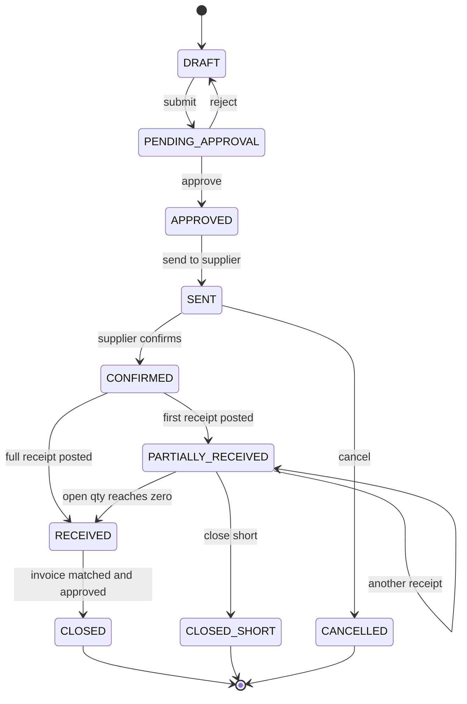
```mermaid
stateDiagram-v2
    [*] --> DRAFT
    DRAFT --> PENDING_APPROVAL: submit
    PENDING_APPROVAL --> DRAFT: reject
    PENDING_APPROVAL --> APPROVED: approve
    APPROVED --> SENT: send to supplier
    SENT --> CONFIRMED: supplier confirms
    SENT --> CANCELLED: cancel
    CONFIRMED --> PARTIALLY_RECEIVED: first receipt posted
    CONFIRMED --> RECEIVED: full receipt posted
    PARTIALLY_RECEIVED --> PARTIALLY_RECEIVED: another receipt
    PARTIALLY_RECEIVED --> RECEIVED: open qty reaches zero
    PARTIALLY_RECEIVED --> CLOSED_SHORT: close short
    RECEIVED --> CLOSED: invoice matched and approved
    CLOSED --> [*]
    CLOSED_SHORT --> [*]
    CANCELLED --> [*]
```

| From | To | Trigger | Actor | Guard | Event |
|---|---|---|---|---|---|
| — | DRAFT | create | Procurement staff | supplier active, ≥1 line | — |
| DRAFT | PENDING_APPROVAL | submit | Procurement staff | total ≥ 0, MOQ respected (BR-PO-001) | — |
| PENDING_APPROVAL | APPROVED | approve | approver per threshold | approver's limit ≥ PO total (BR-PO-002) | `PurchaseOrderApproved` |
| PENDING_APPROVAL | DRAFT | reject | approver | reason given | — |
| APPROVED | SENT | send | Procurement staff | supplier has email or API endpoint | `PurchaseOrderSent` |
| SENT | CONFIRMED | supplier confirms | Procurement staff (records it) | — | `PurchaseOrderConfirmed` |
| SENT | CANCELLED | cancel | Procurement staff | nothing received yet | `PurchaseOrderCancelled` |
| CONFIRMED / PARTIALLY_RECEIVED | PARTIALLY_RECEIVED | receipt posted | system | receipt total < ordered | — |
| CONFIRMED / PARTIALLY_RECEIVED | RECEIVED | receipt posted | system | open qty = 0, within over-receipt tolerance (BR-RCP-001) | `PurchaseOrderFullyReceived` |
| PARTIALLY_RECEIVED | CLOSED_SHORT | close short | Procurement staff | reason given; remaining qty written off | `PurchaseOrderClosedShort` |
| RECEIVED | CLOSED | invoice approved | Accountant | three-way match passed or override approved (BR-INV-003) | `PurchaseOrderClosed` |

**Amendment (WBS 3.2.5)** is not a state. Amending a PO in `SENT` or later creates
**revision n+1** of the same PO number and emits `PurchaseOrderAmended`; the previous revision is
retained for the audit trail. Amendment is forbidden once any receipt exists (BR-PO-004).

---

## 3. Goods Receipt — `procurement-service`

**Changed 2026-10-09** to the receiving docs (KLTN-FA26/docs 03 Receipt, 05 Putaway, commit
`084365d`) and migration `V20260929000250`. Receiving is a 2-step or 3-step flow, chosen per SKU by
the inventory item's **QC required** flag (snapshotted on the receipt line):

| Flow | SKU | Path |
|---|---|---|
| 3 steps | `qc_required` | supplier → Area `RECEIVING` → Area `QUALITY_CONTROL` → bin |
| 2 steps | not QC-required | supplier → Area `RECEIVING` → bin |

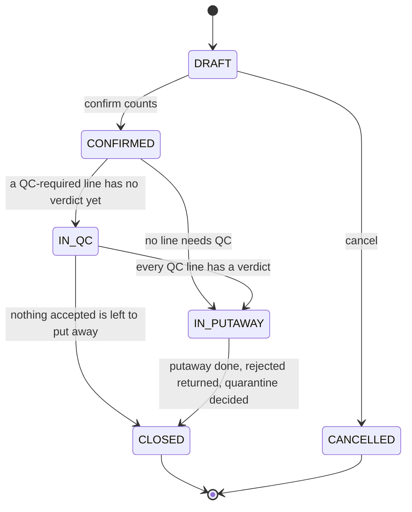
```mermaid
stateDiagram-v2
    [*] --> DRAFT
    DRAFT --> CONFIRMED: confirm counts
    DRAFT --> CANCELLED: cancel
    CONFIRMED --> IN_QC: a QC-required line has no verdict yet
    CONFIRMED --> IN_PUTAWAY: no line needs QC
    IN_QC --> IN_PUTAWAY: every QC line has a verdict
    IN_QC --> CLOSED: nothing accepted is left to put away
    IN_PUTAWAY --> CLOSED: putaway done, rejected returned, quarantine decided
    CLOSED --> [*]
    CANCELLED --> [*]
```

| From | To | Trigger | Actor | Guard | Event |
|---|---|---|---|---|---|
| — | DRAFT | create from PO | Warehouse staff | PO `CONFIRMED` / `PARTIALLY_RECEIVED` (BR-RCP-001) | — |
| DRAFT | CONFIRMED | confirm | Warehouse staff | lot / expiry where required (BR-RCP-003); over-receipt within tolerance, else manager approval | `GoodsReceived` |
| DRAFT | CANCELLED | cancel | Warehouse staff | never confirmed (`ck_goods_receipts_cancelled`) | — |
| CONFIRMED | IN_QC | — | system | ≥1 line with `qc_required`; a **move-to-QC task** (`move_task.origin = RECEIPT_QC`) is created per such line | — |
| CONFIRMED | IN_PUTAWAY | — | system | no line needs QC; putaway tasks from `RECEIVING` | — |
| IN_QC | IN_PUTAWAY | last QC verdict | QC staff | QC only on goods already in the QC area (BR-08); accepted + quarantined + rejected = moved quantity | `QcCompleted` |
| IN_PUTAWAY / IN_QC | CLOSED | — | system | every line handled | — |

**What confirming does to inventory.** Stock rows appear in the `RECEIVING` area in condition
**INBOUND** (machine 5). A QC-required line then moves `RECEIVING → QUALITY_CONTROL` (still INBOUND);
QC splits it: **accepted** → putaway task from the QC area; **quarantine** → Area `QUARANTINE`,
condition QUARANTINE; **rejected** → Area `QUARANTINE`, condition BLOCKED, return to vendor. A
confirmed receipt is never deleted; mistakes are reversals or adjustments with a reason (BR-05).

---

## 4. Supplier Invoice — `procurement-service`

WBS 3.4.3 (three-way match), 3.4.4 (exceptions), 3.4.5.2 (Pending/Paid).

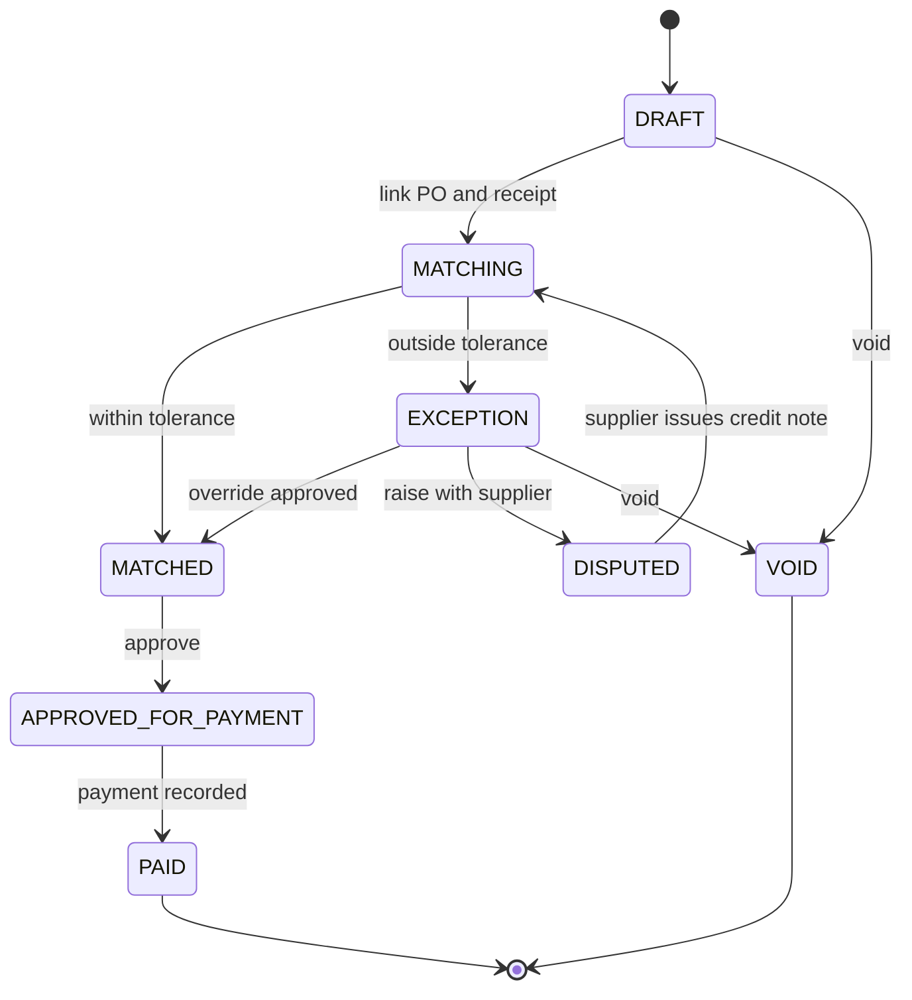
```mermaid
stateDiagram-v2
    [*] --> DRAFT
    DRAFT --> MATCHING: link PO and receipt
    MATCHING --> MATCHED: within tolerance
    MATCHING --> EXCEPTION: outside tolerance
    EXCEPTION --> MATCHED: override approved
    EXCEPTION --> DISPUTED: raise with supplier
    DISPUTED --> MATCHING: supplier issues credit note
    MATCHED --> APPROVED_FOR_PAYMENT: approve
    APPROVED_FOR_PAYMENT --> PAID: payment recorded
    PAID --> [*]
    DRAFT --> VOID: void
    EXCEPTION --> VOID: void
    VOID --> [*]
```

| From | To | Trigger | Actor | Guard | Event |
|---|---|---|---|---|---|
| — | DRAFT | enter invoice | Accountant | supplier invoice number unique per supplier (BR-INV-001) | — |
| DRAFT | MATCHING | link | Accountant | at least one PO and one receipt linked | — |
| MATCHING | MATCHED | auto | system | qty and price within tolerance (BR-INV-002) | `InvoiceMatched` |
| MATCHING | EXCEPTION | auto | system | outside tolerance | `InvoiceMatchException` |
| EXCEPTION | MATCHED | override | Accountant with approval limit | approver's limit ≥ variance (BR-INV-003) | `InvoiceOverrideApproved` |
| EXCEPTION | DISPUTED | dispute | Accountant | reason recorded | — |
| DISPUTED | MATCHING | credit note posted | Accountant | credit note linked | — |
| MATCHED | APPROVED_FOR_PAYMENT | approve | Accountant | within payment approval limit | `InvoiceApprovedForPayment` |
| APPROVED_FOR_PAYMENT | PAID | record payment | Accountant | — | `SupplierInvoicePaid` |

---

## 5. Stock condition — `inventory-service`

This machine governs the **condition** dimension only. Quantities (on hand / reserved /
allocated) are numbers on the same record, not states — see `01-ubiquitous-language.md`.
Stored as `inventory.stock_item.status`; `GOOD` in older text is `AVAILABLE`.

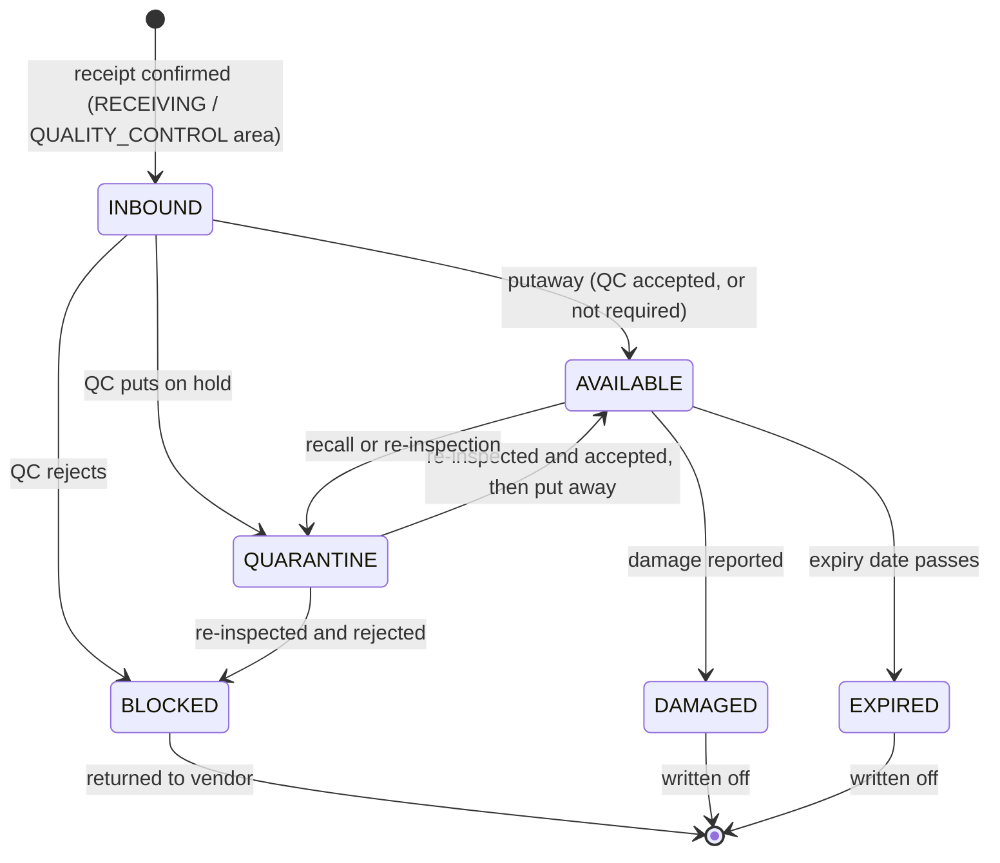
```mermaid
stateDiagram-v2
    [*] --> INBOUND: receipt confirmed (RECEIVING / QUALITY_CONTROL area)
    INBOUND --> AVAILABLE: putaway (QC accepted, or not required)
    INBOUND --> QUARANTINE: QC puts on hold
    INBOUND --> BLOCKED: QC rejects
    QUARANTINE --> AVAILABLE: re-inspected and accepted, then put away
    QUARANTINE --> BLOCKED: re-inspected and rejected
    BLOCKED --> [*]: returned to vendor
    AVAILABLE --> DAMAGED: damage reported
    AVAILABLE --> EXPIRED: expiry date passes
    AVAILABLE --> QUARANTINE: recall or re-inspection
    DAMAGED --> [*]: written off
    EXPIRED --> [*]: written off
```

| From | To | Trigger | Actor | Guard | Event |
|---|---|---|---|---|---|
| — | INBOUND | receipt confirmed | system | — | `StockReceived` |
| INBOUND | AVAILABLE | putaway completed | Warehouse staff | QC accepted or not required (docs 05 BR-01) | `StockPutAway` |
| INBOUND | QUARANTINE / BLOCKED | QC verdict | QC staff | reason given | `QcCompleted` |
| QUARANTINE | AVAILABLE | re-inspection accepts | QC staff | then putaway from the `QUARANTINE` area | `StockReleasedFromQuarantine` |
| QUARANTINE | BLOCKED | re-inspection rejects | QC staff | reason given | `StockBlocked(BLOCKED)` |
| BLOCKED | left stock | return to vendor | Procurement staff | movement out of the warehouse | `ReturnToVendorRaised` |
| AVAILABLE | DAMAGED | report damage | Warehouse staff | reason and photo (BR-STK-003) | `StockBlocked(DAMAGED)` |
| AVAILABLE | EXPIRED | nightly sweep | system | `expiry_date < today` (BR-STK-004) | `StockBlocked(EXPIRED)` |
| AVAILABLE | QUARANTINE | recall | Warehouse manager | reason given | `StockBlocked(QUARANTINE)` |
| DAMAGED / EXPIRED | written off | write-off | Warehouse manager | approved adjustment (BR-STK-005) | `StockWrittenOff` |

**Only AVAILABLE counts towards ATP.** That single sentence is the reason this dimension is separate
from the quantity buckets: inbound, quarantined and blocked stock is on hand, occupies its location, appears in a
physical count, and is invisible to the storefront.

**Reserved stock whose condition turns bad.** If AVAILABLE stock with an outstanding reservation moves
to DAMAGED or EXPIRED, the reservation is *not* silently dropped — `inventory-service` emits
`ReservationImpaired`, and `order-service` puts the order on hold with reason
`INVENTORY_ISSUE` (WBS 3.17.6.1). Dropping it quietly is how a paid order never ships.

---

## 6. Stock reservation — `inventory-service`

WBS 3.14.5.1 (time-limited) and 3.14.5.2 (expiry and auto-release).

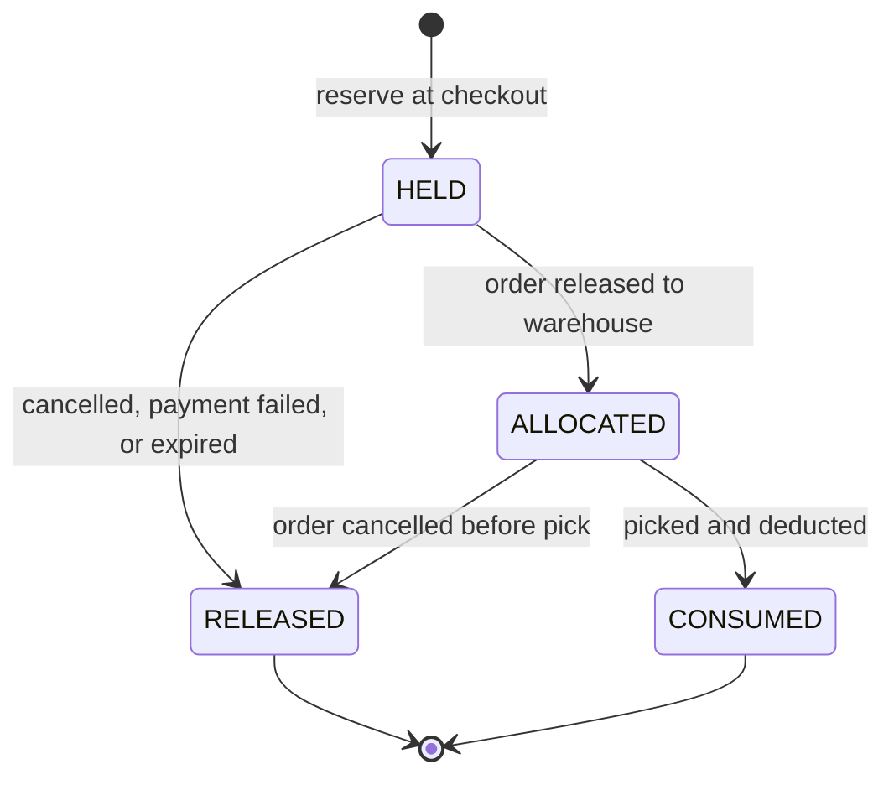
```mermaid
stateDiagram-v2
    [*] --> HELD: reserve at checkout
    HELD --> ALLOCATED: order released to warehouse
    HELD --> RELEASED: cancelled, payment failed, or expired
    ALLOCATED --> CONSUMED: picked and deducted
    ALLOCATED --> RELEASED: order cancelled before pick
    RELEASED --> [*]
    CONSUMED --> [*]
```

| From | To | Trigger | Actor | Guard | Event |
|---|---|---|---|---|---|
| — | HELD | reserve | system, at checkout | ATP ≥ requested (BR-STK-001) | `StockReserved` |
| HELD | RELEASED | expiry sweep | system | `expires_at < now` (BR-STK-002) | `StockReservationReleased(RESERVATION_EXPIRED)` |
| HELD | RELEASED | payment failed | system | — | `StockReservationReleased(PAYMENT_FAILED)` |
| HELD | RELEASED | customer cancels | Customer / Sales staff | order not yet released | `StockReservationReleased(ORDER_CANCELLED)` |
| HELD | ALLOCATED | order released | Order coordinator | a location and lot chosen by FEFO (BR-STK-006) | `StockAllocated` |
| ALLOCATED | CONSUMED | pick confirmed | Warehouse staff | picked qty = allocated qty | `StockDeducted` |
| ALLOCATED | RELEASED | cancel after allocation | Order coordinator | not yet picked; put-back task raised (WBS 3.7.7.2) | `StockReservationReleased(ORDER_CANCELLED)` |

**The reservation clock is the most under-specified part of the BRD.** WBS 3.14.5.1 says
"time-limited" without saying how long. See `06-open-questions.md`, OQ-03.

---

## 7. Putaway task — `warehouse-service`

WBS 3.3.6 (generation), 3.5.4 (management).

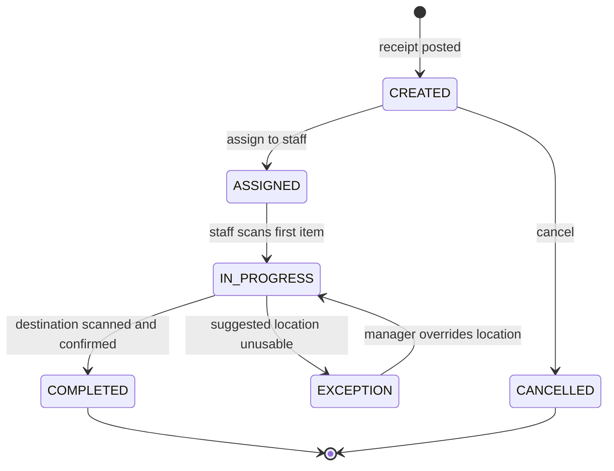
```mermaid
stateDiagram-v2
    [*] --> CREATED: receipt posted
    CREATED --> ASSIGNED: assign to staff
    ASSIGNED --> IN_PROGRESS: staff scans first item
    IN_PROGRESS --> COMPLETED: destination scanned and confirmed
    IN_PROGRESS --> EXCEPTION: suggested location unusable
    EXCEPTION --> IN_PROGRESS: manager overrides location
    CREATED --> CANCELLED: cancel
    COMPLETED --> [*]
    CANCELLED --> [*]
```

| From | To | Trigger | Actor | Guard | Event |
|---|---|---|---|---|---|
| — | CREATED | receipt posted | system | slotting engine returns ≥1 suggestion (BR-SLT-001) | `PutawayTaskCreated` |
| CREATED | ASSIGNED | assign | Warehouse manager, or auto | staff assigned to that warehouse | — |
| ASSIGNED | IN_PROGRESS | scan item | Warehouse staff | scanned SKU matches the task | — |
| IN_PROGRESS | COMPLETED | confirm location | Warehouse staff | scanned location = suggested, or override approved (BR-SLT-002) | `PutawayCompleted` |
| IN_PROGRESS | EXCEPTION | report blocked | Warehouse staff | reason given | — |
| EXCEPTION | IN_PROGRESS | override | Warehouse manager | new location passes hard constraints (BR-SLT-003) | — |

`PutawayCompleted` is what moves stock from the receiving area to a real bin. Until then, the
stock exists with the location code of a `RECEIVING` area (e.g. `HCM-RCV01`) and is **not**
pickable.

---

## 8. Design snapshot — `design-service`

WBS 3.12.5 (immutable artifact), 3.12.4 (preflight), 3.8.3 (verification at packing).

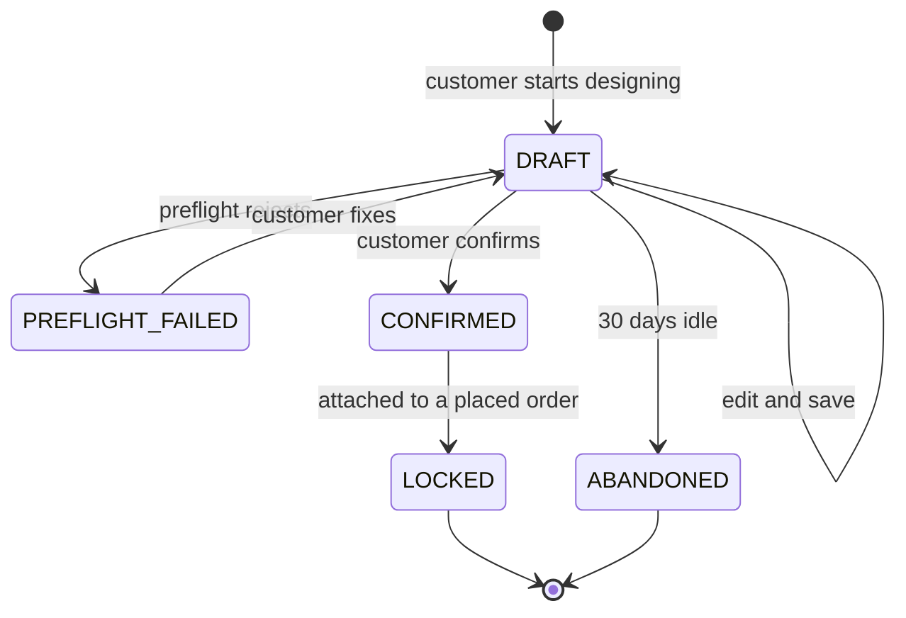
```mermaid
stateDiagram-v2
    [*] --> DRAFT: customer starts designing
    DRAFT --> DRAFT: edit and save
    DRAFT --> PREFLIGHT_FAILED: preflight rejects
    PREFLIGHT_FAILED --> DRAFT: customer fixes
    DRAFT --> CONFIRMED: customer confirms
    CONFIRMED --> LOCKED: attached to a placed order
    LOCKED --> [*]
    DRAFT --> ABANDONED: 30 days idle
    ABANDONED --> [*]
```

| From | To | Trigger | Actor | Guard | Event |
|---|---|---|---|---|---|
| — | DRAFT | open the studio | Customer / Sales staff | SKU has a print configuration | — |
| DRAFT | PREFLIGHT_FAILED | confirm attempted | system | DPI, bleed, safe area or colour mode fails (BR-DSG-001) | — |
| DRAFT | CONFIRMED | confirm | Customer / Sales staff | preflight passed | `DesignConfirmed` |
| CONFIRMED | LOCKED | order placed | system | order line references this snapshot | — |
| DRAFT | ABANDONED | idle sweep | system | untouched 30 days and not on an order | — |

**A CONFIRMED snapshot is never edited.** "Changing the design" creates a **new snapshot** and
re-points the order line, which is allowed only while the order is in `PENDING_PAYMENT` or
`CONFIRMED` (BR-DSG-002). After that the print file may already be at the press.

The checksum stored on the order line is compared again at packing (WBS 3.8.3). A mismatch is not
a warning — it stops the pack and raises an exception, because it means the parcel does not
contain what the customer approved.

---

## 9. Order — `order-service`

The central machine. WBS 3.17.1.1 spells it out:
`Pending Payment → Confirmed → Ready to Fulfill → In Production → Picking → Packed → Shipped →
Delivered → Completed/Cancelled`. Hold (3.17.6) and RMA (3.17.5) attach to it.

**Changed 2026-10-06** (B2B only, production module): an order is a wholesale order created from
an accepted quote or on the customer portal. A **credit** order skips `PENDING_PAYMENT` — it is
`CONFIRMED` within the customer's credit limit, `ON_HOLD` (reason `CREDIT`) above it. Release
sends print lines to production **before** the order is ready to fulfil: `CONFIRMED →
IN_PRODUCTION → READY_TO_FULFILL`, and the order leaves `IN_PRODUCTION` only when every production
order of the order is completed (machine 16).

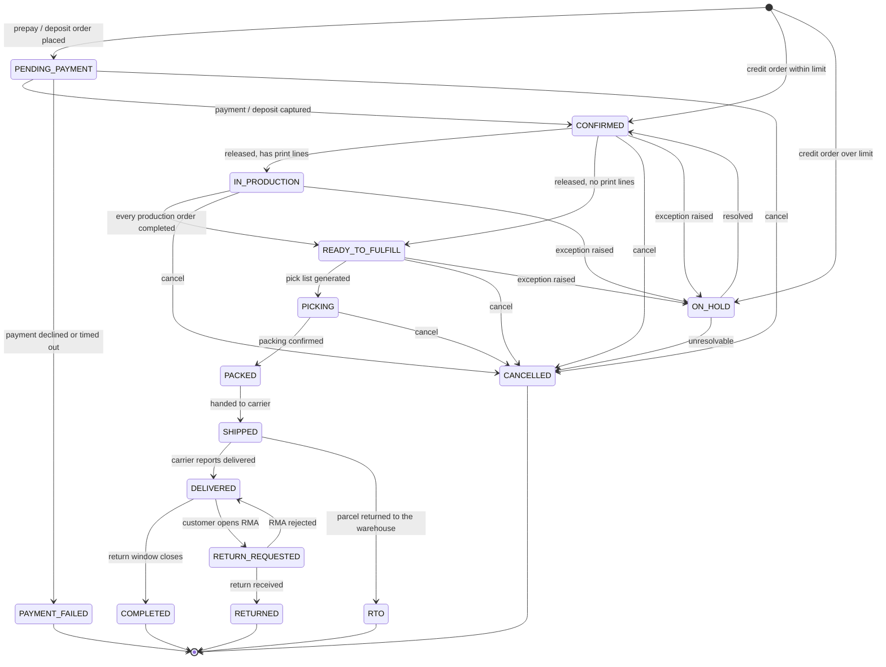
```mermaid
stateDiagram-v2
    [*] --> PENDING_PAYMENT: prepay / deposit order placed
    [*] --> CONFIRMED: credit order within limit
    [*] --> ON_HOLD: credit order over limit
    PENDING_PAYMENT --> CONFIRMED: payment / deposit captured
    PENDING_PAYMENT --> PAYMENT_FAILED: payment declined or timed out
    PAYMENT_FAILED --> [*]
    CONFIRMED --> IN_PRODUCTION: released, has print lines
    CONFIRMED --> READY_TO_FULFILL: released, no print lines
    IN_PRODUCTION --> READY_TO_FULFILL: every production order completed
    READY_TO_FULFILL --> PICKING: pick list generated
    PICKING --> PACKED: packing confirmed
    PACKED --> SHIPPED: handed to carrier
    SHIPPED --> DELIVERED: carrier reports delivered
    SHIPPED --> RTO: parcel returned to the warehouse
    DELIVERED --> COMPLETED: return window closes
    DELIVERED --> RETURN_REQUESTED: customer opens RMA
    RETURN_REQUESTED --> DELIVERED: RMA rejected
    RETURN_REQUESTED --> RETURNED: return received
    RETURNED --> [*]
    RTO --> [*]
    COMPLETED --> [*]

    PENDING_PAYMENT --> CANCELLED: cancel
    CONFIRMED --> CANCELLED: cancel
    READY_TO_FULFILL --> CANCELLED: cancel
    IN_PRODUCTION --> CANCELLED: cancel
    PICKING --> CANCELLED: cancel
    CANCELLED --> [*]

    CONFIRMED --> ON_HOLD: exception raised
    READY_TO_FULFILL --> ON_HOLD: exception raised
    IN_PRODUCTION --> ON_HOLD: exception raised
    ON_HOLD --> CONFIRMED: resolved
    ON_HOLD --> CANCELLED: unresolvable
```

| From | To | Trigger | Actor | Guard | Event |
|---|---|---|---|---|---|
| — | PENDING_PAYMENT | order placed (prepay / deposit) | Customer / Sales staff | active B2B customer; every line reserved (BR-ORD-001); quantity ≥ MOQ (BR-ORD-007) | `OrderPlaced` |
| — | CONFIRMED | order placed (credit) | Customer / Sales staff | outstanding balance + order total ≤ credit limit (BR-PAY-005) | `OrderPlaced`, `OrderConfirmed` |
| — | ON_HOLD | order placed (credit) | system | over the credit limit; reason `CREDIT` | `OrderPlaced`, `OrderPutOnHold` |
| PENDING_PAYMENT | CONFIRMED | payment captured | system | amount = order total, or deposit rule met (BR-PAY-002) | `OrderConfirmed` |
| PENDING_PAYMENT | PAYMENT_FAILED | declined or timed out | system | reservations released first | `OrderPaymentFailed` |
| CONFIRMED | IN_PRODUCTION | release | Order coordinator | warehouse chosen; ≥1 print line; every new design has an APPROVED sample (BR-PRD-08); deposit received (BR-PRD-09) | `OrderLinesReleasedForProduction` |
| CONFIRMED | READY_TO_FULFILL | release | Order coordinator | warehouse chosen; no print lines; stock allocated (BR-ORD-002) | `OrderReleased` |
| IN_PRODUCTION | READY_TO_FULFILL | production completed | system | every production order of the order COMPLETED (BR-PRD-06) | `OrderReleased` |
| READY_TO_FULFILL | PICKING | pick list generated | system | stock lines allocated; print output already in the PACKING area | `PickListGenerated` |
| PICKING | PACKED | packing confirmed | Warehouse staff | every line picked; design checksums match (BR-DSG-003) | `OrderPacked` |
| PACKED | SHIPPED | handover | Warehouse staff | manifest signed by carrier | `ShipmentDispatched` |
| SHIPPED | DELIVERED | carrier reports delivered | Order coordinator | every shipment of the order DELIVERED; recorded with who and when (no carrier integration) | `OrderDelivered` |
| SHIPPED | RTO | parcel back at the warehouse | Warehouse staff | received through the returns receipt (BR-06 of docs 09) | `OrderReturnedToOrigin` |
| DELIVERED | COMPLETED | window closes | system | 7 days after delivery, no open RMA (BR-ORD-005) | `OrderCompleted` |
| DELIVERED | RETURN_REQUESTED | open RMA | Customer / Sales staff | within return window | `RmaRequested` |
| any of PENDING_PAYMENT…PICKING | CANCELLED | cancel | see below | see BR-ORD-003 | `OrderCancelled` |
| CONFIRMED / READY_TO_FULFILL / IN_PRODUCTION | ON_HOLD | raise exception | Order coordinator, or system | reason is one of PAYMENT / ADDRESS / INVENTORY / CREDIT (WBS 3.17.6.1) | `OrderPutOnHold` |
| ON_HOLD | CONFIRMED | resolve | Order coordinator; for `CREDIT` the credit-limit approver | resolution note recorded | `OrderHoldResolved` |

### Who may cancel, and until when

WBS 3.17.4.1 says the customer may cancel "before shipment". That is too loose to implement —
cancelling during `IN_PRODUCTION` means a cup has already been printed with the customer's
artwork and cannot be resold.

| Order state | Customer may cancel | Sales/coordinator may cancel | Consequence |
|---|---|---|---|
| PENDING_PAYMENT | yes | yes | release reservations |
| CONFIRMED | yes | yes | release reservations, refund in full |
| READY_TO_FULFILL | no — must request | yes | release allocations, raise put-back task |
| IN_PRODUCTION | no — must request | yes, with reason | production orders not yet printing are cancelled and blanks returned; printed items are **not refunded** (BR-ORD-004, BR-PRD-10) |
| PICKING | no | yes, with reason | put-back task (WBS 3.7.7.2) |
| PACKED and later | no | no — must go through RMA | — |

**Implemented 2026-10-10 (SCRUM-460).**
- **One state for "may go ahead":** the code has `CONFIRMED` (kltn-docs 17 §5); `PAID` became `CONFIRMED`.
  The money is the order's `paid_amount`, from which the payment status of kltn-docs 15 §5.2 (UNPAID /
  PARTIALLY_PAID / ON_CREDIT / PAID) is derived. A prepaid order is confirmed when paid in full, a
  deposit order when its deposit is in (15 BR-02). Money arriving later never moves the order.
- **Every cancellation names a reason code** — CUSTOMER_REQUEST, PAYMENT_NOT_RECEIVED, PAYMENT_FAILED,
  OUT_OF_STOCK, SUSPECTED_FRAUD, CREDIT_REJECTED, DUPLICATE_ORDER, PRODUCTION_ISSUE, or OTHER with a note.
- **When the customer cancels directly:** in DRAFT / PENDING_PAYMENT / CONFIRMED, at once. From
  IN_PRODUCTION / READY_TO_FULFILL / IN_FULFILMENT / ON_HOLD the customer opens a **cancellation
  request**, one pending at a time.
- **Who decides a request:** Sales or the coordinator approve or reject it with
  `sales-order-cancellations:UPDATE` (kltn-docs 17 §2), the permission that also cancels from the back
  office.
- **Fee kept:** approving or cancelling from the back office may keep a percentage of what was paid
  (17 §4.4, 15 §4.4, never more than paid — 15 BR-05).
- **`OrderCancelled` is published on every path.**
  - Payment cancels awaited payments and asks back the refundable amount as PENDING refunds.
  - Fulfillment cancels the pick and pack, flagging picked goods for put-back.
  - Production (SCRUM-393) cancels the production orders not yet printing and holds the others; the
    contract is `contracts.OrderCancelled`.

### Order-line status

Order lines carry their own status, because a partially shortable order is normal.

`PENDING → ALLOCATED → PICKED → SHORT → PACKED → SHIPPED → RETURNED`

A line goes `SHORT` when the picker cannot find the allocated quantity (WBS 3.7.5). The order
does **not** fail — it goes `ON_HOLD` with reason `INVENTORY_ISSUE`, and the coordinator either
re-allocates from another location or splits the order.

---

## 10. Payment — `payment-service`

WBS 3.15. Covers gateway, bank transfer, COD, deposit, refund.

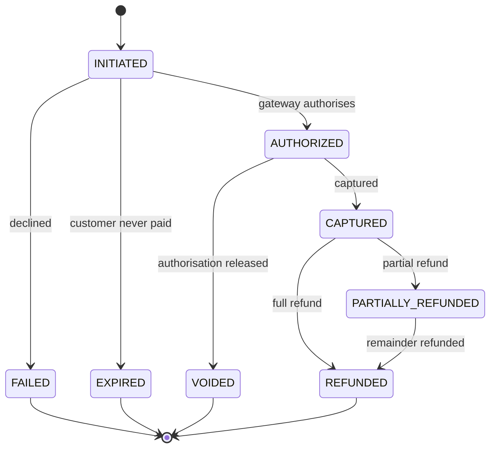
```mermaid
stateDiagram-v2
    [*] --> INITIATED
    INITIATED --> AUTHORIZED: gateway authorises
    INITIATED --> FAILED: declined
    INITIATED --> EXPIRED: customer never paid
    AUTHORIZED --> CAPTURED: captured
    AUTHORIZED --> VOIDED: authorisation released
    CAPTURED --> PARTIALLY_REFUNDED: partial refund
    CAPTURED --> REFUNDED: full refund
    PARTIALLY_REFUNDED --> REFUNDED: remainder refunded
    FAILED --> [*]
    EXPIRED --> [*]
    VOIDED --> [*]
    REFUNDED --> [*]
```

| From | To | Trigger | Actor | Guard | Event |
|---|---|---|---|---|---|
| — | INITIATED | checkout | system | order in PENDING_PAYMENT | `PaymentInitiated` |
| INITIATED | AUTHORIZED | gateway callback | system | signature valid (BR-PAY-001) | — |
| INITIATED | FAILED | gateway callback | system | — | `PaymentFailed` |
| INITIATED | EXPIRED | timeout sweep | system | unpaid past the window | `PaymentFailed` |
| AUTHORIZED | CAPTURED | capture | system, or Accountant for bank transfer | amount ≤ authorised | `PaymentCaptured` |
| CAPTURED | PARTIALLY_REFUNDED / REFUNDED | refund | Accountant | within refund approval limit (BR-PAY-003) | `RefundCompleted` |

**COD is not a payment until the carrier remits.** A COD order is `CONFIRMED` with a payment in
`INITIATED`; it becomes `CAPTURED` only at reconciliation, after the carrier hands the cash over
(WBS 3.15.4). Treating COD as paid at checkout is how the books stop balancing.

**A deposit is a payment for part of the total.** The order moves to `CONFIRMED` when
`sum(captured) ≥ deposit_required` (BR-PAY-002), not when it equals the order total.

---

## 11. Shipment and load — `fulfillment-service`

WBS 3.9. **The carrier is a third party outside the system** (decided 2026-10-06, docs 09): no carrier
API, no carrier waybill, no tracking. The system records the handover and the outcome the carrier
reports back; nothing in between.

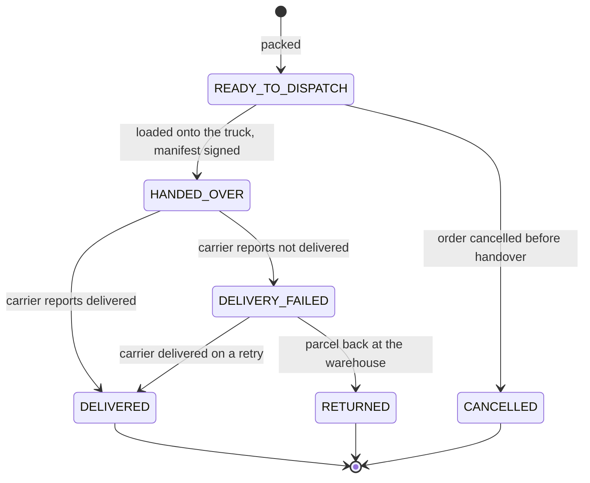
```mermaid
stateDiagram-v2
    [*] --> READY_TO_DISPATCH: packed
    READY_TO_DISPATCH --> HANDED_OVER: loaded onto the truck, manifest signed
    READY_TO_DISPATCH --> CANCELLED: order cancelled before handover
    HANDED_OVER --> DELIVERED: carrier reports delivered
    HANDED_OVER --> DELIVERY_FAILED: carrier reports not delivered
    DELIVERY_FAILED --> DELIVERED: carrier delivered on a retry
    DELIVERY_FAILED --> RETURNED: parcel back at the warehouse
    DELIVERED --> [*]
    RETURNED --> [*]
    CANCELLED --> [*]
```

| From | To | Trigger | Actor | Guard |
|---|---|---|---|---|
| READY_TO_DISPATCH | HANDED_OVER | handover | Warehouse staff | parcel is on a load that is being dispatched; scanned onto that vehicle |
| HANDED_OVER | DELIVERED / DELIVERY_FAILED | outcome reported | Order coordinator | failure carries a reason (absent, refused, wrong address, lost) |
| DELIVERY_FAILED | RETURNED | parcel received back | Warehouse staff | through the returns receipt, never straight into stock |

A **load** is one vehicle (truck or container) and the parcels placed on it:

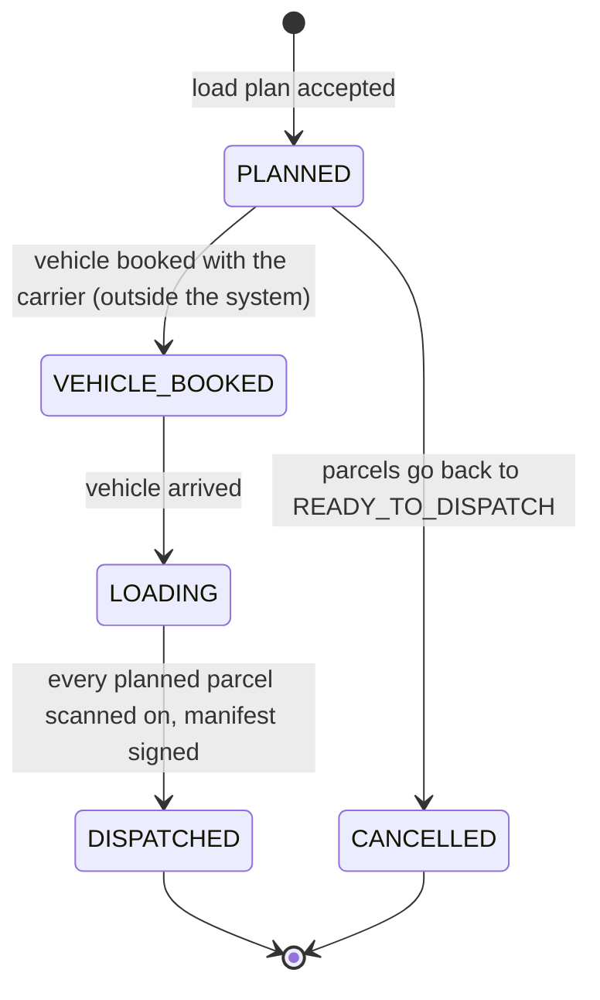
```mermaid
stateDiagram-v2
    [*] --> PLANNED: load plan accepted
    PLANNED --> VEHICLE_BOOKED: vehicle booked with the carrier (outside the system)
    PLANNED --> CANCELLED: parcels go back to READY_TO_DISPATCH
    VEHICLE_BOOKED --> LOADING: vehicle arrived
    LOADING --> DISPATCHED: every planned parcel scanned on, manifest signed
    DISPATCHED --> [*]
    CANCELLED --> [*]
```

The load plan respects the vehicle's internal volume and payload, and never puts a `FRAGILE`
parcel under a heavier one (docs 09 BR-02).

`RETURNED` triggers a **re-putaway** (WBS 3.9.7.2): the goods return to stock through the
same putaway machine, in condition GOOD if the parcel is intact and QUARANTINE otherwise.

> **Schema gap (DB owner):** `fulfillment.shipment_status` today is `PENDING, DISPATCHED, DELIVERED,
> RETURNED`. It needs `DELIVERY_FAILED` and `CANCELLED`, plus tables for the vehicle-type catalogue,
> the load plan and the load with its parcels. `shipment.tracking_number` and the carrier-sourced
> `shipment_event` rows lose their purpose and go in a later contract step.

---

## 12. RMA — `order-service`

WBS 3.17.5.

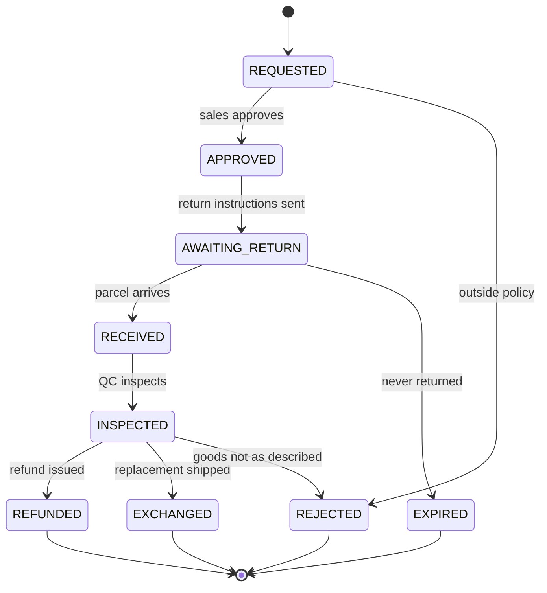
```mermaid
stateDiagram-v2
    [*] --> REQUESTED
    REQUESTED --> APPROVED: sales approves
    REQUESTED --> REJECTED: outside policy
    APPROVED --> AWAITING_RETURN: return instructions sent
    AWAITING_RETURN --> RECEIVED: parcel arrives
    AWAITING_RETURN --> EXPIRED: never returned
    RECEIVED --> INSPECTED: QC inspects
    INSPECTED --> REFUNDED: refund issued
    INSPECTED --> EXCHANGED: replacement shipped
    INSPECTED --> REJECTED: goods not as described
    REFUNDED --> [*]
    EXCHANGED --> [*]
    REJECTED --> [*]
    EXPIRED --> [*]
```

| From | To | Trigger | Actor | Guard | Event |
|---|---|---|---|---|---|
| — | REQUESTED | open RMA | Customer / Sales staff | order DELIVERED, within window (BR-RMA-001) | `RmaRequested` |
| REQUESTED | APPROVED | approve | Sales staff | reason in policy; **custom-printed items are not returnable unless defective** (BR-RMA-002) | `RmaApproved` |
| APPROVED | AWAITING_RETURN | send return instructions | system | customer told to write the RMA number on the parcel; no return label (carriers are outside the system) | — |
| AWAITING_RETURN | RECEIVED | parcel arrives | Warehouse staff | RMA number on parcel | `RmaGoodsReceived` |
| RECEIVED | INSPECTED | inspect | QC staff | condition recorded | `RmaInspected` |
| INSPECTED | REFUNDED | refund | Accountant | within refund limit | `RefundCompleted` |
| INSPECTED | EXCHANGED | ship replacement | Order coordinator | replacement stock available | `ExchangeShipped` |

Returned goods re-enter stock in condition **QUARANTINE**, never GOOD. Whether they become
sellable again is a QC decision, not an automatic one.

---

## 13. Transfer order — `inventory-service`

WBS 3.10.

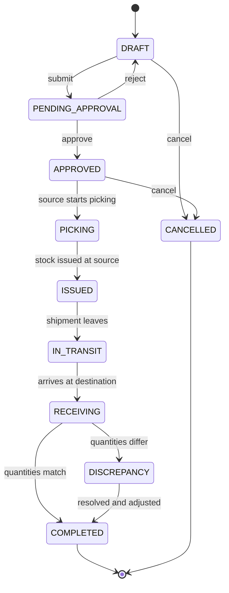
```mermaid
stateDiagram-v2
    [*] --> DRAFT
    DRAFT --> PENDING_APPROVAL: submit
    PENDING_APPROVAL --> DRAFT: reject
    PENDING_APPROVAL --> APPROVED: approve
    APPROVED --> PICKING: source starts picking
    PICKING --> ISSUED: stock issued at source
    ISSUED --> IN_TRANSIT: shipment leaves
    IN_TRANSIT --> RECEIVING: arrives at destination
    RECEIVING --> COMPLETED: quantities match
    RECEIVING --> DISCREPANCY: quantities differ
    DISCREPANCY --> COMPLETED: resolved and adjusted
    DRAFT --> CANCELLED: cancel
    APPROVED --> CANCELLED: cancel
    COMPLETED --> [*]
    CANCELLED --> [*]
```

| From | To | Trigger | Actor | Guard | Event |
|---|---|---|---|---|---|
| — | DRAFT | create | Inventory planner | source ≠ destination | — |
| DRAFT | PENDING_APPROVAL | submit | Inventory planner | source ATP ≥ requested | — |
| PENDING_APPROVAL | APPROVED | approve | Warehouse manager | value within approval threshold (BR-TRF-001) | `TransferApproved` |
| APPROVED | PICKING | start | Warehouse staff | stock reserved at source, FEFO (WBS 3.10.3.2) | `TransferPickStarted` |
| PICKING | ISSUED | issue | Warehouse staff | picked = approved qty | `TransferIssued` |
| ISSUED | IN_TRANSIT | dispatch | Warehouse staff | — | `TransferInTransit` |
| IN_TRANSIT | RECEIVING | arrival | Warehouse staff (destination) | — | — |
| RECEIVING | COMPLETED | confirm | Warehouse staff | received = issued | `TransferCompleted` |
| RECEIVING | DISCREPANCY | confirm with variance | Warehouse staff | variance logged (WBS 3.10.6.1) | `TransferDiscrepancyRaised` |
| DISCREPANCY | COMPLETED | resolve | Warehouse manager | write-off approved (WBS 3.10.6.3) | `TransferCompleted` |

**In-transit stock belongs to neither warehouse's on-hand.** Between `ISSUED` and `COMPLETED` the
units sit in a dedicated in-transit bucket. Leaving them on the source's on-hand lets the source
oversell them; adding them to the destination early lets the destination sell goods that are on a
truck. This is the single most common transfer bug.

---

## 14. Cycle count — `inventory-service`

WBS 3.6.6.

`PLANNED → COUNTING → VARIANCE_REVIEW → APPROVED → POSTED`, plus `CANCELLED` from PLANNED.

A count with zero variance may skip `VARIANCE_REVIEW` and post directly. Any variance needs
manager approval (WBS 3.6.5.2) before it touches stock — a cycle count is the one place where an
unapproved number can silently rewrite inventory.

---

## 15. Chat conversation — `chat-service`

WBS 3.16.2.2 names the states: `OPEN → RESOLVED`, with `ESCALATED` in between.

`OPEN → ASSIGNED → RESOLVED`, `ASSIGNED → ESCALATED → ASSIGNED`, `RESOLVED → OPEN` on a customer
reply within 24 hours. SLA timers (WBS 3.16.6) run on `OPEN` and `ESCALATED` only.

---

## 16. Production order — `production`

New 2026-10-06. One per custom order line (`ORDER`) or per sample request (`SAMPLE`). Both kinds
run the same workshop steps; only the source and the end differ. Business doc:
`kltn-docs/docs/warehouse/19-production`.

**Subcontracting** (added 2026-10-06, §4.4 of the business doc): when the in-house shop cannot meet
the due date, the warehouse manager splits part of an `ORDER` production order into a **child**
production order with `execution = SUBCONTRACTED`, linked to its parent and to a `SUBCONTRACT`
purchase order. The child skips `MATERIAL_ISSUED` / `PRINTING` and goes
`READY → SUBCONTRACTED → QC`. Splitting does not change the parent's state, only its quantity.
Two modes, chosen per split: `SUPPLIED_BLANKS` (we send the blanks; they stay our stock at a
virtual subcontractor location, outside ATP) and `FULL_SERVICE` (the subcontractor sources the
blanks; we buy finished goods).

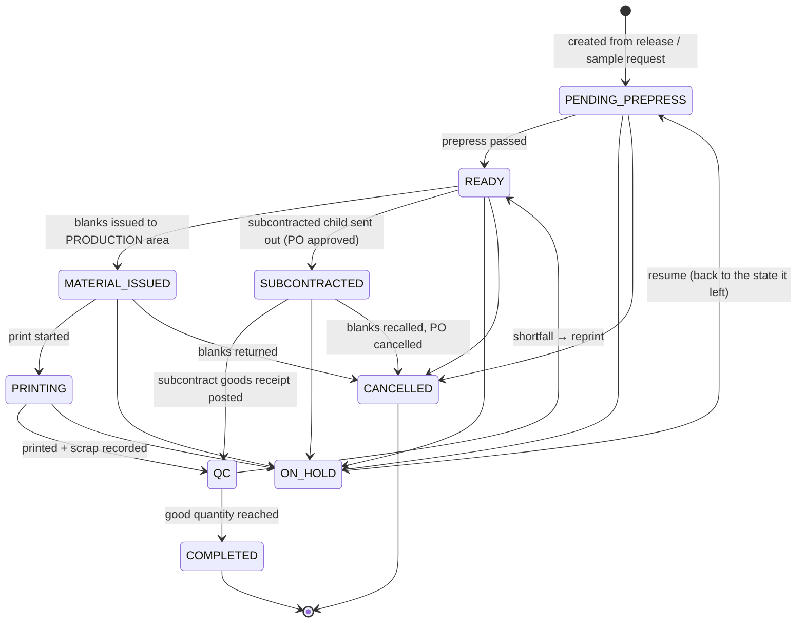
```mermaid
stateDiagram-v2
    [*] --> PENDING_PREPRESS: created from release / sample request
    PENDING_PREPRESS --> READY: prepress passed
    READY --> MATERIAL_ISSUED: blanks issued to PRODUCTION area
    MATERIAL_ISSUED --> PRINTING: print started
    PRINTING --> QC: printed + scrap recorded
    QC --> COMPLETED: good quantity reached
    QC --> READY: shortfall → reprint
    READY --> SUBCONTRACTED: subcontracted child sent out (PO approved)
    SUBCONTRACTED --> QC: subcontract goods receipt posted
    PENDING_PREPRESS --> ON_HOLD
    READY --> ON_HOLD
    MATERIAL_ISSUED --> ON_HOLD
    PRINTING --> ON_HOLD
    SUBCONTRACTED --> ON_HOLD
    ON_HOLD --> PENDING_PREPRESS: resume (back to the state it left)
    PENDING_PREPRESS --> CANCELLED
    READY --> CANCELLED
    MATERIAL_ISSUED --> CANCELLED: blanks returned
    SUBCONTRACTED --> CANCELLED: blanks recalled, PO cancelled
    COMPLETED --> [*]
    CANCELLED --> [*]
```

| From | To | Trigger | Actor | Guard | Event |
|---|---|---|---|---|---|
| — | PENDING_PREPRESS | release / sample submitted | system | one per source line (BR-PRD-01) | — |
| PENDING_PREPRESS | READY | prepress pass | Production staff | file checksum = locked snapshot (BR-PRD-02) | — |
| READY | MATERIAL_ISSUED | blanks scanned out | Warehouse staff | issued ≤ remaining need (BR-PRD-03) | — |
| MATERIAL_ISSUED | PRINTING | start | Production staff | — | — |
| PRINTING | QC | record output | Production staff | good + scrap = printed; scrap has a reason (BR-PRD-04) | — |
| QC | COMPLETED | QC pass | QC staff | good quantity = required; ORDER compared with the approved sample (BR-PRD-05) | `ProductionCompleted` (ORDER) |
| QC | READY | shortfall | QC staff | more blanks reserved; none → ON_HOLD | — |
| PENDING_PREPRESS / READY / ON_HOLD | *(unchanged)* + child PENDING_PREPRESS or READY | split for subcontracting | Warehouse manager | ORDER only (BR-PRD-11); 0 < split < quantity not yet issued (BR-PRD-12); active subcontractor; child inherits the parent's prepress result | — |
| READY | SUBCONTRACTED | send to subcontractor (child only) | Warehouse staff | `SUBCONTRACT` PO approved (BR-PRD-13); SUPPLIED_BLANKS: blanks scanned to the subcontractor location (BR-PRD-15) | — |
| SUBCONTRACTED | QC | subcontract goods receipt posted | system | SUPPLIED_BLANKS: blank reconciliation done, excess loss approved (BR-PRD-16, 17) | — |
| any before COMPLETED | ON_HOLD | hold | Production staff / Warehouse manager | reason: bad file, out of blanks, machine down, waiting for customer, subcontractor late | — |
| PENDING_PREPRESS / READY / MATERIAL_ISSUED | CANCELLED | cancel | Warehouse manager | issued blanks returned to stock | — |
| SUBCONTRACTED | CANCELLED | cancel | Warehouse manager | blanks recalled from the subcontractor, PO cancelled (or fee paid per BR-PRD-10) | — |

Once `PRINTING` or `SUBCONTRACTED`, the design cannot change (BR-PRD-07, BR-PRD-14) and
cancellation follows BR-PRD-10. A shortfall on a subcontracted child goes back to `READY`, from
where the manager either sends more to the same subcontractor (PO supplement) or splits the gap
into a new in-house child.

---

## 17. Sample request — `production`

New 2026-10-06. Mandatory for a new design (design + blank pair without an approved sample).

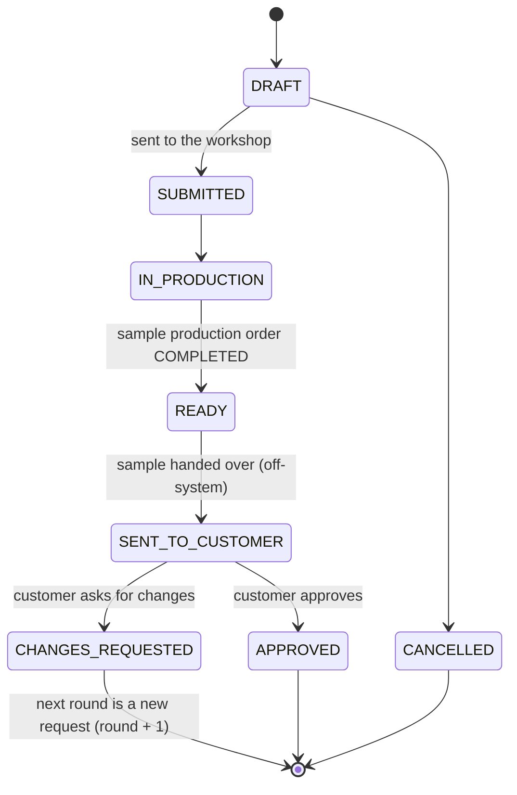
```mermaid
stateDiagram-v2
    [*] --> DRAFT
    DRAFT --> SUBMITTED: sent to the workshop
    SUBMITTED --> IN_PRODUCTION
    IN_PRODUCTION --> READY: sample production order COMPLETED
    READY --> SENT_TO_CUSTOMER: sample handed over (off-system)
    SENT_TO_CUSTOMER --> APPROVED: customer approves
    SENT_TO_CUSTOMER --> CHANGES_REQUESTED: customer asks for changes
    CHANGES_REQUESTED --> [*]: next round is a new request (round + 1)
    DRAFT --> CANCELLED
    APPROVED --> [*]
    CANCELLED --> [*]
```

| From | To | Trigger | Actor | Guard | Event |
|---|---|---|---|---|---|
| DRAFT | SUBMITTED | submit | Sales staff | confirmed design snapshot; blanks reservable | — |
| READY | SENT_TO_CUSTOMER | mark sent | Sales staff | — | — |
| SENT_TO_CUSTOMER | APPROVED | approve | Customer (portal) / Sales staff on their behalf | — | `SampleApproved` |
| SENT_TO_CUSTOMER | CHANGES_REQUESTED | request changes | Customer / Sales staff | feedback recorded | — |

`APPROVED` locks the design for the design + blank pair and becomes the QC reference for order
production (BR-PRD-05, BR-PRD-08).

---

## 18. Quote — `order`

New 2026-10-06 (B2B only). Partly built in PR #38 (`DesignQuote`).

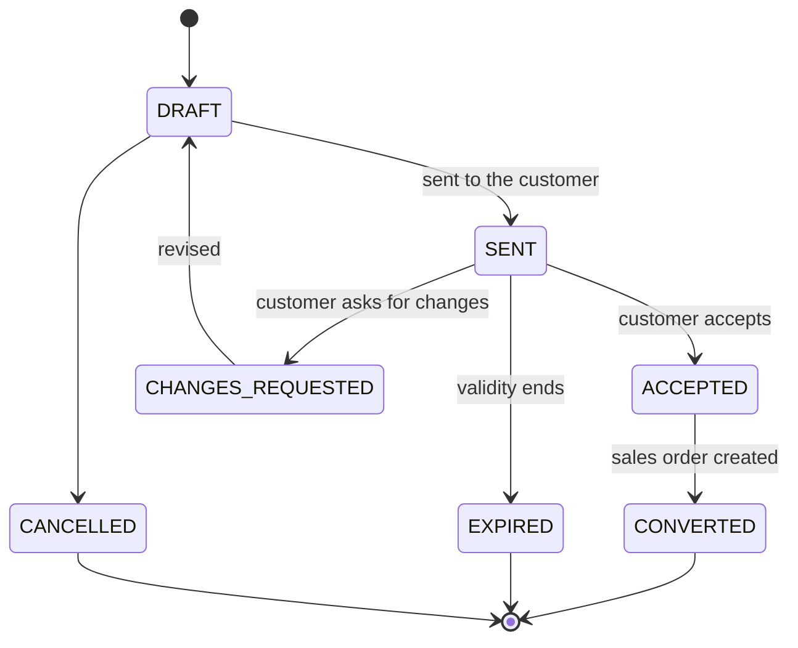
```mermaid
stateDiagram-v2
    [*] --> DRAFT
    DRAFT --> SENT: sent to the customer
    SENT --> ACCEPTED: customer accepts
    SENT --> CHANGES_REQUESTED: customer asks for changes
    CHANGES_REQUESTED --> DRAFT: revised
    SENT --> EXPIRED: validity ends
    ACCEPTED --> CONVERTED: sales order created
    DRAFT --> CANCELLED
    CONVERTED --> [*]
    EXPIRED --> [*]
    CANCELLED --> [*]
```

| From | To | Trigger | Actor | Guard | Event |
|---|---|---|---|---|---|
| DRAFT | SENT | send | Sales staff | discount within the sales staff's limit, or approved | — |
| SENT | ACCEPTED | accept | Customer (portal) | within validity; every new design has an APPROVED sample (BR-PRD-08) | — |
| ACCEPTED | CONVERTED | create order | system / Sales staff | lines reserved (BR-ORD-001) | `OrderPlaced` |
| SENT | EXPIRED | validity ends | system | — | — |

