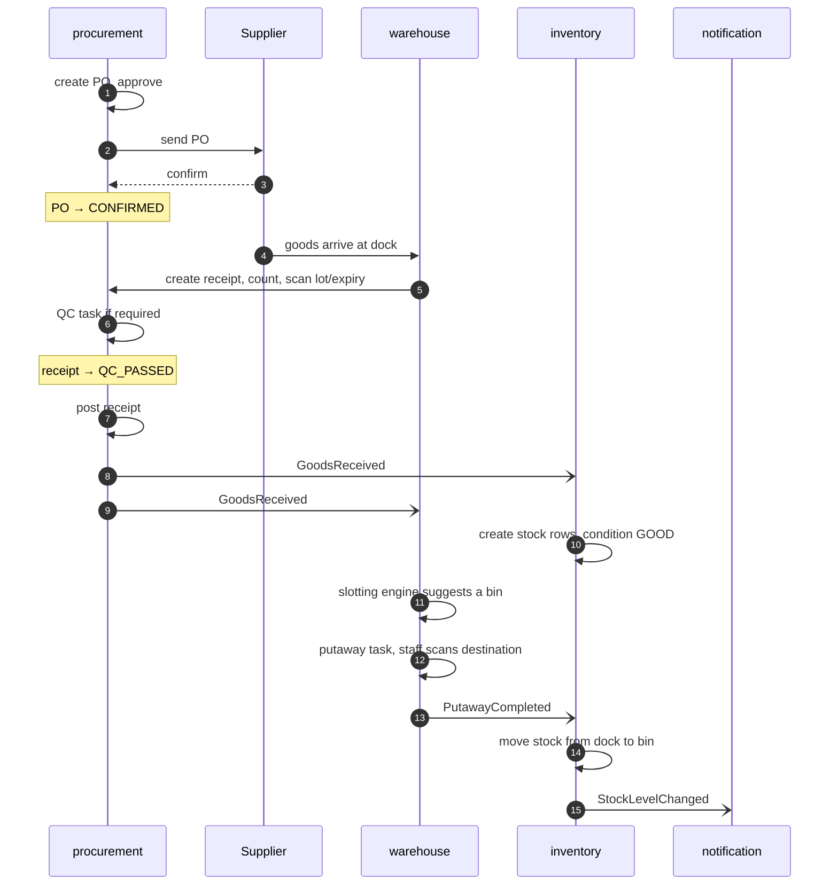
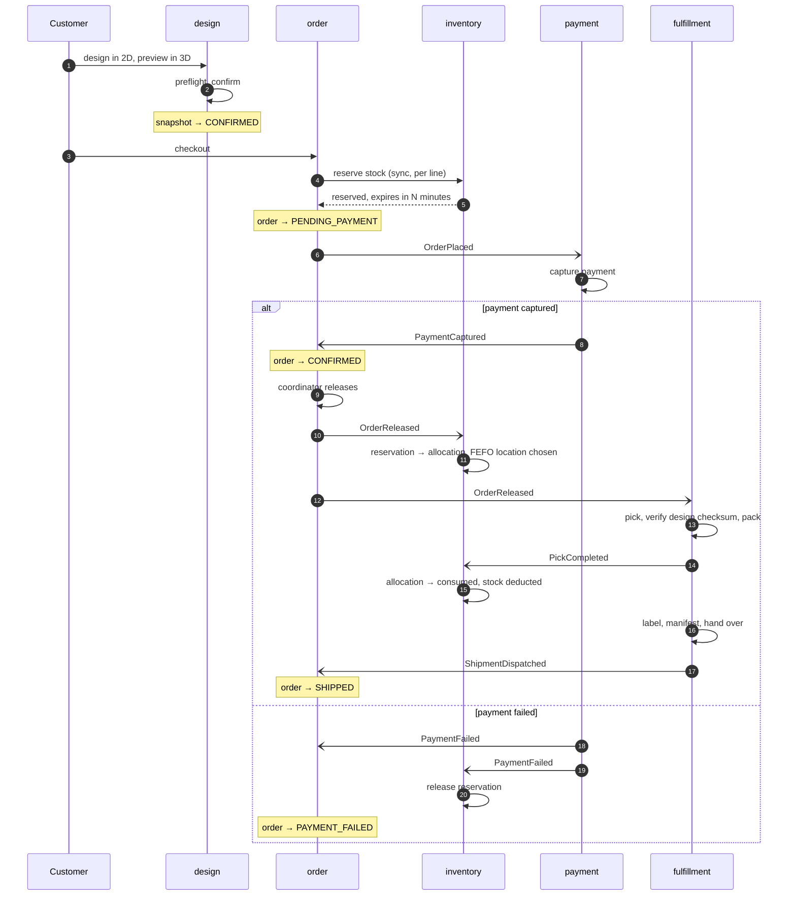
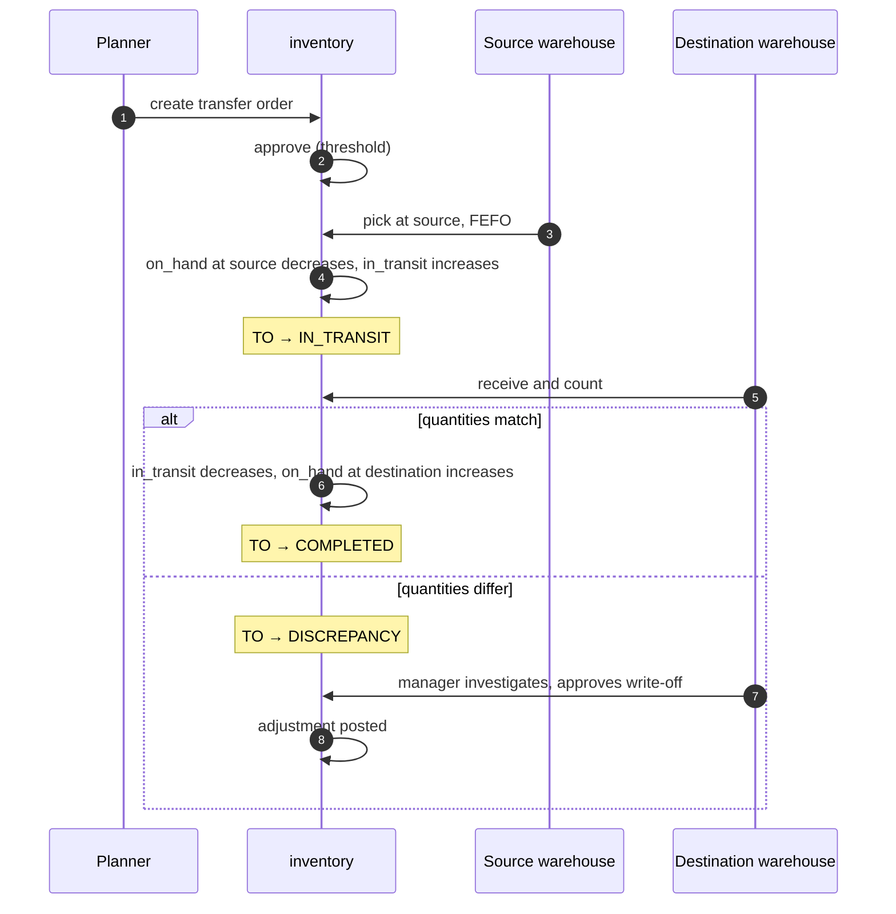
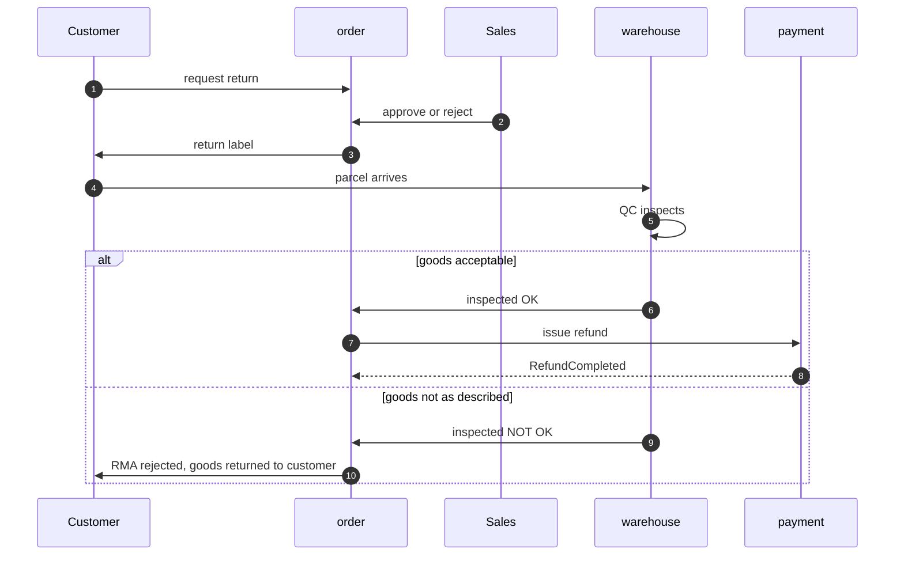

# Data Flows

Four end-to-end flows. Each step names **which service writes**, **what data changes**, **which
status moves** and **which event leaves the service**. Read them alongside
`03-state-machines.md`: the flows say what happens in what order, the machines say what is legal.

Notation in the tables: `→` is a status transition, `+` is a row created, `~` is a row updated.

---

## Flow A — Inbound: from purchase order to sellable stock



| # | Service | Actor | Data written | Status | Event out |
|---|---|---|---|---|---|
| 1 | procurement | Procurement staff | `+purchase_order`, `+po_line` | → DRAFT | — |
| 2 | procurement | Approver | `~purchase_order.approved_by` | DRAFT → APPROVED | `PurchaseOrderApproved` |
| 3 | procurement | Procurement staff | `~purchase_order.sent_at` | APPROVED → SENT | `PurchaseOrderSent` |
| 4 | procurement | Procurement staff | `~purchase_order.confirmed_at` | SENT → CONFIRMED | `PurchaseOrderConfirmed` |
| 5 | procurement | Warehouse staff | `+goods_receipt`, `+receipt_line` | → DRAFT → COUNTING | — |
| 6 | procurement | Warehouse staff | `~receipt_line.qty_received`, `.lot_number`, `.expiry_date`, `+receipt_photo` | COUNTING → COUNTED | — |
| 7 | procurement | system | `+qc_task` | COUNTED → QC_PENDING | `QcTaskCreated` |
| 8 | procurement | QC staff | `+qc_result` | QC_PENDING → QC_PASSED | `QcCompleted(ACCEPTED)` |
| 9 | procurement | Warehouse staff | `~goods_receipt.posted_at`; PO open qty recomputed | QC_PASSED → POSTED; PO → PARTIALLY_RECEIVED or RECEIVED | **`GoodsReceived`** |
| 10 | inventory | system (consumer) | `+stock_item` at the dock location, condition GOOD | — | `StockReceived` |
| 11 | warehouse | system (consumer) | `+putaway_task` with ranked suggestions | → CREATED | `PutawayTaskCreated` |
| 12 | warehouse | Warehouse staff | `~putaway_task.actual_location` | CREATED → … → COMPLETED | **`PutawayCompleted`** |
| 13 | inventory | system (consumer) | `~stock_item.location_code` | — | `StockLevelChanged` |

**Where this flow can go wrong, and what happens**

| Situation | Handling | WBS |
|---|---|---|
| Received more than ordered | Within tolerance → posts normally. Outside → blocked until a warehouse manager approves (BR-RCP-001) | 3.3.8.1 |
| Received less than ordered | PO stays PARTIALLY_RECEIVED; procurement chases the supplier or closes it short | 3.2.4.1 |
| QC rejects | Receipt → QC_REJECTED → RTV; **no stock row is ever created** | 3.3.4.4 |
| QC quarantines | Stock rows are created in condition QUARANTINE — on hand, not sellable | 3.3.5.2 |
| Suggested bin is full or blocked | Task → EXCEPTION; manager overrides with a location that still passes the hard constraints | 3.5.2.3 |
| Lot-tracked SKU received without a lot number | Counting cannot be finished (BR-RCP-003) | 3.3.3.1 |

---

## Flow B — Outbound: from design to delivered parcel

The long one. Six services, two sagas, one compensating path.



| # | Service | Actor | Data written | Status | Event out |
|---|---|---|---|---|---|
| 1 | design | Customer | `+design_draft` | → DRAFT | — |
| 2 | design | system | preflight result | DRAFT, or → PREFLIGHT_FAILED | — |
| 3 | design | Customer | `+design_snapshot` (JSON + checksum in object storage) | → CONFIRMED | `DesignConfirmed` |
| 4 | order | Customer | `+cart_item` | — | — |
| 5 | order | Customer | `+order`, `+order_line` with **snapshotted** name, price, address | → PENDING_PAYMENT | — |
| 6 | inventory | order (sync call) | `+stock_reservation` with `expires_at` | → HELD | `StockReserved` |
| 7 | order | system | `~order.reserved_at` | PENDING_PAYMENT | **`OrderPlaced`** |
| 8 | payment | system | `+payment` | → INITIATED → AUTHORIZED → CAPTURED | **`PaymentCaptured`** |
| 9 | order | system (consumer) | `~order.paid_at` | PENDING_PAYMENT → CONFIRMED | `OrderConfirmed` |
| 10 | order | Order coordinator | `~order.warehouse_code` | CONFIRMED → READY_TO_FULFILL | **`OrderReleased`** |
| 11 | inventory | system (consumer) | `+stock_allocation` at a specific location and lot (FEFO) | reservation HELD → ALLOCATED | `StockAllocated` |
| 12 | fulfillment | system (consumer) | `+pick_list`, `+pick_line` | → PICKING | `PickListGenerated` |
| 13 | fulfillment | Warehouse staff | `~pick_line.picked_qty` | line PENDING → PICKED | `PickCompleted` |
| 14 | inventory | system (consumer) | `~stock_item.on_hand`, `.allocated` | allocation → CONSUMED | **`StockDeducted`** |
| 15 | fulfillment | Warehouse staff | `+package`, checksum compared to the order line | order PICKING → PACKED | `OrderPacked` |
| 16 | fulfillment | Warehouse staff | `+shipment`, `+label`, `+manifest_entry` | shipment → HANDED_OVER | **`ShipmentDispatched`** |
| 17 | order | system (consumer) | `~order.shipped_at` | PACKED → SHIPPED | `OrderStatusChanged` |
| 18 | fulfillment | Carrier webhook | `~shipment.tracking_status`, `+pod` | → DELIVERED | `OrderDelivered` |
| 19 | order | system | — | SHIPPED → DELIVERED → COMPLETED after 7 days | `OrderCompleted` |

**Two sagas, not one.** The checkout saga (steps 5–9) is short and must answer the customer
within seconds. The fulfilment saga (steps 10–17) runs for hours or days and nobody is waiting on
a screen. Treating them as one long saga is why order systems end up with request timeouts.

**Where this flow can go wrong**

| Situation | Handling | WBS |
|---|---|---|
| Not enough ATP at checkout | Checkout fails before the order row exists — no order is created | 3.14.5.1 |
| Customer abandons after reserving | Sweeper releases at `expires_at`; ATP recovers automatically | 3.14.5.2 |
| Payment declined | Reservations released, order → PAYMENT_FAILED, cart is preserved so the customer can retry | 3.15.2 |
| Picker cannot find the allocated stock | Line → SHORT, order → ON_HOLD(INVENTORY_ISSUE); coordinator re-allocates or splits | 3.7.5.1 |
| Design checksum mismatch at packing | **Pack is stopped**, order → ON_HOLD; the parcel does not contain what was approved | 3.8.3.3 |
| Stock condition turns DAMAGED while reserved | `ReservationImpaired` → order → ON_HOLD(INVENTORY_ISSUE) | 3.17.6.1 |
| Carrier reports undeliverable | shipment → RTO_IN_TRANSIT → RTO_RECEIVED, goods re-putaway in QUARANTINE | 3.9.7 |

---

## Flow C — Inter-warehouse transfer

The flow that most often corrupts inventory, because the goods exist while belonging to nobody.



| # | Service | Actor | Data written | Status |
|---|---|---|---|---|
| 1 | inventory | Inventory planner | `+transfer_order`, `+transfer_line` | → DRAFT → PENDING_APPROVAL |
| 2 | inventory | Warehouse manager | `~transfer_order.approved_by` | → APPROVED |
| 3 | inventory | Warehouse staff (source) | `+stock_reservation` at source | → PICKING |
| 4 | inventory | Warehouse staff (source) | `~stock_item.on_hand −`, `+in_transit_stock` | → ISSUED → IN_TRANSIT |
| 5 | inventory | Warehouse staff (dest) | `~transfer_line.received_qty` | → RECEIVING |
| 6a | inventory | system | `−in_transit_stock`, `+stock_item` at destination, condition GOOD | → COMPLETED |
| 6b | inventory | Warehouse manager | `+stock_adjustment` for the variance | DISCREPANCY → COMPLETED |

**The invariant that must hold at every moment:**

```
on_hand(source) + in_transit(TO) + on_hand(destination) = constant
```

Anything that breaks it is a bug, and it is worth asserting in an integration test rather than
discovering at the annual stock take.

---

## Flow D — Return (RMA)



| # | Service | Actor | Data written | Status | Event out |
|---|---|---|---|---|---|
| 1 | order | Customer | `+rma`, `+rma_line` | → REQUESTED | `RmaRequested` |
| 2 | order | Sales staff | `~rma.approved_by` | → APPROVED (or REJECTED) | `RmaApproved` |
| 3 | fulfillment | system | `+return_label` | → AWAITING_RETURN | — |
| 4 | procurement / warehouse | Warehouse staff | `+return_receipt` | → RECEIVED | `RmaGoodsReceived` |
| 5 | inventory | system | `+stock_item` in condition **QUARANTINE** | — | `StockReceived` |
| 6 | procurement | QC staff | `+qc_result` | → INSPECTED | `RmaInspected` |
| 7 | payment | Accountant | `+refund` | payment → PARTIALLY_REFUNDED or REFUNDED | `RefundCompleted` |
| 8 | order | system | `~order.status` | DELIVERED → RETURNED | `OrderStatusChanged` |

**Custom-printed goods are the exception.** A cup printed with a customer's photograph has no
resale value. BR-RMA-002 makes such lines non-returnable unless defective, and when they are
returned as defective they go straight to condition DAMAGED, not QUARANTINE — there is nothing to
inspect them back into.
