# Bản đồ toàn bộ luồng dữ liệu

25 luồng của StockFlowCommerce: chính, phụ, ngoại lệ và nền tảng. Mỗi luồng gồm sơ đồ
service–database và bảng liệt kê từng bước ghi vào bảng nào.

Ký hiệu trong bảng: `+` tạo dòng · `~` sửa dòng · `−` trừ hoặc xoá.
Trong sơ đồ: nét đứt = event qua Kafka, nét liền = gọi REST đồng bộ.

**Mọi mũi tên event đều đi qua transactional outbox** — không luồng nào gửi thẳng message ra
Kafka. Xem ADR-0003.

## Mục lục


**Nhập hàng** — 5 luồng

- `F-PRD` Tạo sản phẩm, duyệt, đưa lên sàn (WBS 3.1)
- `F-PO` Đơn mua hàng gửi nhà cung cấp (WBS 3.2)
- `F-RCP` Nhận hàng, đếm, quét lô, kiểm QC (WBS 3.3)
- `F-PUT` Slotting và putaway — hàng vào đúng kệ (WBS 3.5)
- `F-MTC` Đối chiếu ba chiều và trả tiền nhà cung cấp (WBS 3.4)

**Bán hàng** — 6 luồng

- `F-DSG` Thiết kế 2D, xem 3D, chốt snapshot (WBS 3.12)
- `F-CAT` Đồng bộ catalog và số tồn hiển thị (WBS 3.13)
- `F-CART` Giỏ hàng, checkout và giữ chỗ tồn (WBS 3.14)
- `F-PAY` Thanh toán — bốn hình thức, bốn thời điểm ghi nhận (WBS 3.15)
- `F-FUL` Phát lệnh, nhặt hàng, đóng gói (WBS 3.7 · 3.8)
- `F-SHP` Giao hàng và theo dõi tới lúc có POD (WBS 3.9)

**Vận hành kho** — 4 luồng

- `F-TRF` Điều chuyển giữa hai kho (WBS 3.10)
- `F-REP` Bổ sung nội bộ kho — từ khu dự trữ ra khu nhặt (WBS 3.11)
- `F-CNT` Kiểm kê và điều chỉnh tồn (WBS 3.6.6)
- `F-EXP` Quét hết hạn hằng đêm (WBS 3.6.7)

**Sau bán hàng** — 3 luồng

- `F-RMA` Trả hàng và đổi hàng (WBS 3.17.5)
- `F-RTO` Hàng hoàn về vì giao không thành công (WBS 3.9.7)
- `F-REF` Hoàn tiền và đối soát với cổng thanh toán (WBS 3.15.6 · 3.20.4)

**Ngoại lệ** — 3 luồng

- `X-SHORT` Nhặt thiếu — đơn không hỏng, đơn dừng lại (WBS 3.7.5)
- `X-RESV` Giữ chỗ hết hạn — tồn tự phục hồi (WBS 3.14.5.2)
- `X-CHK` Lệch checksum thiết kế — dừng đóng gói (WBS 3.8.3)

**Nền tảng** — 4 luồng

- `P-PERM` 14 service tự đăng ký catalog phân quyền (WBS 3.19.1)
- `P-NOTI` Thông báo — một event, nhiều kênh (WBS 3.19.2)
- `P-RPT` Read model báo cáo dựng từ event stream (WBS 3.20)
- `P-CHAT` Chat tư vấn dẫn tới đơn hàng đặt hộ (WBS 3.16)

---


# Nhập hàng

## `F-PRD` Tạo sản phẩm, duyệt, đưa lên sàn

*WBS 3.1*

Luồng ngắn nhất nhưng là gốc của mọi thứ khác: không có SKU thì không mua được, không nhập được, không bán được.

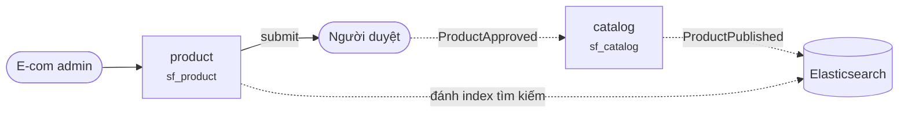

| # | Service | Ghi vào | Kết quả |
|---|---|---|---|
| 01 | `product` | `+ product, + variant × N` | status = DRAFT |
| 02 | `product` | `+ sku (unique toàn hệ thống)` | BR-PRD-002 |
| 03 | `product` | `~ product.status` | → PENDING_APPROVAL |
| 04 | `product` | `~ product, + product_approval, + outbox_event` | → APPROVED · ProductApproved |
| 05 | `product` | `~ product, + outbox_event` | → PUBLISHED · ProductPublished |
| 06 | `catalog` | `+ processed_event, + catalog_product, + catalog_price` | bản sao đọc |
| 07 | `catalog` | `→ Elasticsearch index` | tài liệu tìm kiếm |

> · DRAFT → PENDING_APPROVAL → APPROVED → PUBLISHED. Người duyệt phải khác người gửi — BR-PRD-003.
> · catalog-service giữ BẢN SAO chỉ gồm sản phẩm đã publish, không phải toàn bộ product master.

---

## `F-PO` Đơn mua hàng gửi nhà cung cấp

*WBS 3.2*

Từ nháp tới lúc nhà cung cấp xác nhận. Ngưỡng duyệt là chỗ dễ làm sai nhất.

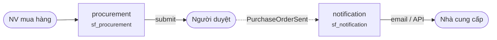

| # | Service | Ghi vào | Kết quả |
|---|---|---|---|
| 01 | `procurement` | `+ purchase_order, + po_line × N` | status = DRAFT |
| 02 | `procurement` | `~ purchase_order.status` | → PENDING_APPROVAL |
| 03 | `procurement` | `~ purchase_order, + po_approval, + outbox_event` | → APPROVED |
| 04 | `procurement` | `~ purchase_order.sent_at, + outbox_event` | → SENT · PurchaseOrderSent |
| 05 | `notification` | `+ processed_event, + notification` | gửi PO cho NCC |
| 06 | `procurement` | `~ purchase_order.confirmed_at` | → CONFIRMED |
| 07 | `procurement` | `+ po_revision (nếu sửa)` | PurchaseOrderAmended |

> · Hạn mức người duyệt phải ≥ giá trị PO — BR-PO-002, kiểm trong aggregate chứ không ở controller.
> ⚠ Sửa PO sau khi đã có phiếu nhập là CẤM. Phải tạo revision mới — BR-PO-004.

---

## `F-RCP` Nhận hàng, đếm, quét lô, kiểm QC

*WBS 3.3*

Nơi hàng thật gặp hệ thống lần đầu. Kết quả QC quyết định hàng vào kho ở trạng thái nào.

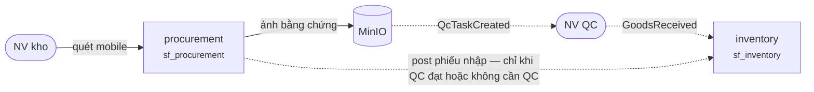

| # | Service | Ghi vào | Kết quả |
|---|---|---|---|
| 01 | `procurement` | `+ goods_receipt, + receipt_line × N` | status = DRAFT, chép qty từ PO |
| 02 | `procurement` | `~ receipt_line.quantity_received, .lot_number, .expiry_date` | BR-RCP-003 |
| 03 | `MinIO` | `+ receipts/{id}/photo-*.jpg` | ảnh bằng chứng |
| 04 | `procurement` | `+ qc_task` | status = PENDING, cho SKU có cờ QC |
| 05 | `procurement` | `+ qc_result, ~ goods_receipt` | → QC_PASSED | QC_QUARANTINED | QC_REJECTED |
| 06 | `procurement` | `~ goods_receipt, ~ purchase_order.open_qty, + outbox_event` | → POSTED · GoodsReceived |
| 07 | `inventory` | `+ processed_event, + stock_item, + stock_movement` | condition = GOOD | QUARANTINE |

> ⚠ QC REJECTED thì đi nhánh RTV và KHÔNG dòng tồn kho nào được tạo — WBS 3.3.4.4.
> · QC QUARANTINED thì stock_item vẫn được tạo, nhưng condition = QUARANTINE: có mặt, không bán được.
> · Nhận vượt quá dung sai 5% thì không post được nếu chưa có duyệt quản lý kho — BR-RCP-001.

---

## `F-PUT` Slotting và putaway — hàng vào đúng kệ

*WBS 3.5*

Giữa bước này và bước trước, hàng đã tồn tại trong hệ thống nhưng chưa nhặt được. Đây là bước làm cho nó bán được.

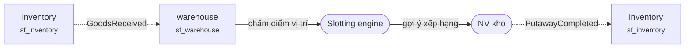

| # | Service | Ghi vào | Kết quả |
|---|---|---|---|
| 01 | `warehouse` | `+ processed_event, + putaway_task` | status = CREATED |
| 02 | `warehouse` | `+ putaway_suggestion × N` | vị trí xếp hạng + lý do từng gợi ý |
| 03 | `warehouse` | `~ putaway_task.assigned_to` | → ASSIGNED |
| 04 | `warehouse` | `~ putaway_task (quét item)` | → IN_PROGRESS |
| 05 | `warehouse` | `~ putaway_task.actual_location, ~ location.occupied_*, + outbox_event` | → COMPLETED |
| 06 | `inventory` | `~ stock_item.location_code, + stock_movement, + outbox_event` | StockLevelChanged |
| 07 | `catalog` | `~ atp_cache` | hàng bắt đầu bán được |

> · Vị trí vi phạm ràng buộc cứng (hazmat, nhiệt độ, single-SKU) bị LOẠI HẲN trước khi chấm điểm — BR-SLT-001.
> · Mỗi gợi ý phải kèm LÝ DO và lý do đó được lưu cùng task — BR-SLT-004.
> ★ Chỉ sau PutawayCompleted thì location_code mới là kệ thật và ATP mới tính hàng này.

---

## `F-MTC` Đối chiếu ba chiều và trả tiền nhà cung cấp

*WBS 3.4*

PO ↔ Phiếu nhập ↔ Hoá đơn. Lệch ngoài dung sai thì phải người có hạn mức đủ lớn mới override được.

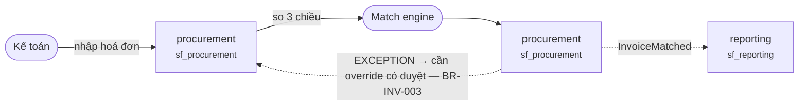

| # | Service | Ghi vào | Kết quả |
|---|---|---|---|
| 01 | `procurement` | `+ supplier_invoice, + invoice_line × N` | status = DRAFT |
| 02 | `procurement` | `+ invoice_po_link, + invoice_receipt_link` | → MATCHING |
| 03 | `procurement` | `+ match_result` | MATCHED | EXCEPTION theo dung sai |
| 04 | `procurement` | `+ invoice_override (nếu lệch)` | cần hạn mức ≥ chênh lệch |
| 05 | `procurement` | `~ supplier_invoice, + outbox_event` | → APPROVED_FOR_PAYMENT |
| 06 | `procurement` | `~ supplier_invoice, ~ purchase_order` | → PAID · PO → CLOSED |
| 07 | `reporting` | `+ processed_event, ~ ap_aging` | read model công nợ |

> · Số hoá đơn phải duy nhất theo từng nhà cung cấp — BR-INV-001.
> · PO chỉ chuyển sang CLOSED khi hoá đơn đã được duyệt chi.

---


# Bán hàng

## `F-DSG` Thiết kế 2D, xem 3D, chốt snapshot

*WBS 3.12*

Điểm khác biệt của cả nền tảng. Snapshot đã chốt là bất biến — sửa thiết kế nghĩa là tạo snapshot mới.

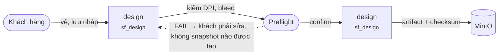

| # | Service | Ghi vào | Kết quả |
|---|---|---|---|
| 01 | `design` | `+ design_draft` | status = DRAFT, canvas JSON |
| 02 | `MinIO` | `+ design-assets/{id}/*` | ảnh khách upload |
| 03 | `design` | `~ design_draft.preflight_result` | PASS | FAIL + danh sách lỗi |
| 04 | `design` | `+ design_snapshot` | status = CONFIRMED, checksum SHA-256 |
| 05 | `MinIO` | `+ design-snapshots/{id}.json` | artifact BẤT BIẾN |
| 06 | `design` | `+ outbox_event` | DesignConfirmed |
| 07 | `design` | `~ design_snapshot.status` | → LOCKED khi đơn được đặt |

> · Preflight kiểm: DPI ảnh, vùng an toàn, bleed, chế độ màu RGB/CMYK, font đã nhúng — BR-DSG-001.
> ★ Checksum SHA-256 của snapshot được chép sang order_line và so lại lúc đóng gói — BR-DSG-003.

---

## `F-CAT` Đồng bộ catalog và số tồn hiển thị

*WBS 3.13*

Hai nguồn dữ liệu chảy vào cùng một bản sao đọc: thông tin sản phẩm từ product, con số ATP từ inventory.

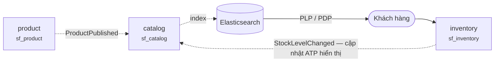

| # | Service | Ghi vào | Kết quả |
|---|---|---|---|
| 01 | `catalog` | `+ processed_event, + catalog_product` | từ ProductPublished |
| 02 | `catalog` | `+ catalog_price, + catalog_media, + seo_metadata` |  |
| 03 | `Elasticsearch` | `+ document` | đánh index tìm kiếm |
| 04 | `catalog` | `~ atp_cache` | từ StockLevelChanged |
| 05 | `catalog` | `→ trả PLP/PDP cho khách` | dải tồn, không phải số chính xác |

> · Khách chỉ thấy DẢI tồn (còn hàng / sắp hết / hết), không thấy con số chính xác — OQ-10.
> · Con số ATP chính xác chỉ trả về ở giỏ hàng, và lúc checkout thì gọi thẳng inventory-service.
> ⚠ catalog-service KHÔNG được dùng để quyết định giữ chỗ — bản sao có thể trễ vài giây.

---

## `F-CART` Giỏ hàng, checkout và giữ chỗ tồn

*WBS 3.14*

Chỗ duy nhất trong luồng bán hàng gọi đồng bộ — vì khách đang đứng chờ trước màn hình.

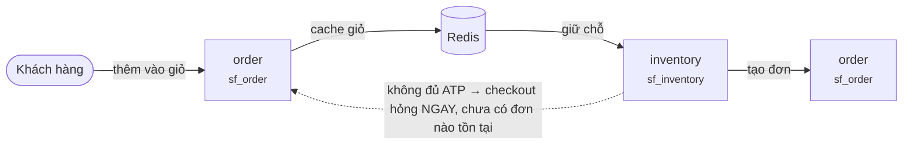

| # | Service | Ghi vào | Kết quả |
|---|---|---|---|
| 01 | `order` | `+ cart_item` | sku, qty, design_snapshot_id nếu là hàng in |
| 02 | `Redis` | `~ cart:{sessionId}` | cache, TTL 30 ngày |
| 03 | `order` | `→ catalog: lấy giá hiện hành` | tính tổng, thuế, phí ship |
| 04 | `order` | `~ cart.voucher_code` | kiểm hiệu lực voucher |
| 05 | `inventory` | `+ stock_reservation, ~ stock_item.reserved, + outbox_event` | status = HELD · StockReserved |
| 06 | `order` | `+ order, + order_line × N, + order_status_history` | → PENDING_PAYMENT |
| 07 | `order` | `− cart_item, + outbox_event` | dọn giỏ · OrderPlaced |

> ★ Đơn chỉ được tạo sau khi MỌI dòng đã giữ chỗ xong. Đơn giữ chỗ một phần không bao giờ được lưu — BR-ORD-001.
> ★ order_line CHÉP tên sản phẩm, đơn giá và địa chỉ tại thời điểm này. Giá đổi ngày mai không đổi hoá đơn hôm nay.
> · Reservation có expires_at: 15 phút cho thẻ/ví, 24 giờ cho chuyển khoản, 30 phút cho COD — OQ-03.

---

## `F-PAY` Thanh toán — bốn hình thức, bốn thời điểm ghi nhận

*WBS 3.15*

Cùng một máy trạng thái, nhưng thời điểm chuyển sang CAPTURED khác nhau hoàn toàn. Nhầm chỗ này là sổ sách lệch.

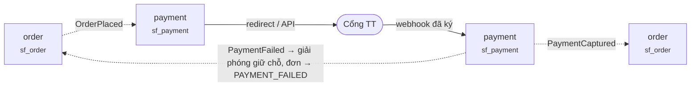

| # | Service | Ghi vào | Kết quả |
|---|---|---|---|
| 01 | `payment` | `+ processed_event, + payment` | status = INITIATED |
| 02 | `payment` | `~ payment.status` | → AUTHORIZED (thẻ/ví) |
| 03 | `payment` | `+ payment_transaction` | payload thô của cổng, để đối soát |
| 04 | `payment` | `~ payment.status, + outbox_event` | → CAPTURED · PaymentCaptured |
| 05 | `order` | `+ processed_event, ~ order, + order_status_history` | → CONFIRMED |
| 06 | `payment` | `+ cod_remittance (nếu COD)` | đối chiếu với hãng vận chuyển |
| 07 | `payment` | `+ deposit_record (nếu đặt cọc)` | theo dõi số dư còn phải trả |

> · Thẻ / ví: CAPTURED ngay khi cổng callback. Chuyển khoản: khi kế toán đối chiếu sao kê.
> ⚠ COD: CHỈ CAPTURED khi hãng vận chuyển chuyển tiền về — BR-PAY-004. Coi COD là đã trả lúc checkout là sổ sách sai.
> · Đặt cọc: đơn → CONFIRMED khi tổng đã thu ≥ mức cọc yêu cầu, không phải bằng tổng đơn — BR-PAY-002.
> ⚠ Webhook sai chữ ký thì KHÔNG đổi trạng thái gì, chỉ ghi log — BR-PAY-001.

---

## `F-FUL` Phát lệnh, nhặt hàng, đóng gói

*WBS 3.7 · 3.8*

Reservation mềm chuyển thành allocation cứng, rồi mới trừ kho thật. Ba mức, không gộp được.

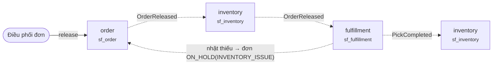

| # | Service | Ghi vào | Kết quả |
|---|---|---|---|
| 01 | `order` | `~ order.warehouse_code, + outbox_event` | → READY_TO_FULFILL · OrderReleased |
| 02 | `inventory` | `+ stock_allocation, ~ stock_reservation, ~ stock_item.allocated` | HELD → ALLOCATED, chọn FEFO |
| 03 | `fulfillment` | `+ pick_list, + pick_line × N` | location_code, lot_number từ allocation |
| 04 | `fulfillment` | `~ pick_line.picked_qty, + outbox_event` | PickCompleted |
| 05 | `inventory` | `~ stock_item.on_hand −, .allocated −, + stock_movement` | StockDeducted |
| 06 | `fulfillment` | `+ design_verification` | so checksum với artifact trong MinIO |
| 07 | `fulfillment` | `+ package, + outbox_event` | → PACKED · OrderPacked |

> · Bước phân bổ chọn vị trí và lô cụ thể theo FEFO — BR-STK-006. Trước đó reservation không gắn vị trí nào.
> ★ Tồn kho THẬT SỰ giảm ở bước PickCompleted, không phải lúc đặt hàng.
> ⚠ Lệch checksum thiết kế lúc đóng gói thì DỪNG, không đóng — BR-DSG-003.

---

## `F-SHP` Giao hàng và theo dõi tới lúc có POD

*WBS 3.9*

Mỗi hãng vận chuyển đặt tên trạng thái một kiểu. Phải chuẩn hoá về máy trạng thái của mình trước khi cho phần còn lại của hệ thống nhìn thấy.

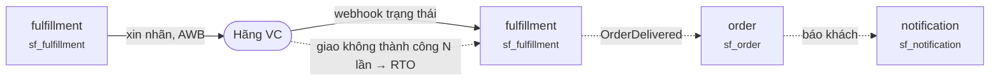

| # | Service | Ghi vào | Kết quả |
|---|---|---|---|
| 01 | `fulfillment` | `+ shipment` | status = CREATED |
| 02 | `fulfillment` | `~ shipment.tracking_number, .awb` | → LABELLED |
| 03 | `MinIO` | `+ labels/{awb}.pdf` | file nhãn |
| 04 | `fulfillment` | `+ manifest_entry, ~ manifest` | → MANIFESTED → HANDED_OVER |
| 05 | `fulfillment` | `+ tracking_event (mỗi lần webhook)` | nhật ký thô |
| 06 | `fulfillment` | `~ shipment.tracking_status` | đã chuẩn hoá |
| 07 | `fulfillment` | `+ pod, + outbox_event` | ảnh và chữ ký · OrderDelivered |

> · Trạng thái thô của hãng lưu vào tracking_event; shipment chỉ giữ trạng thái ĐÃ CHUẨN HOÁ — WBS 3.9.5.2.
> · Sau DELIVERED 7 ngày không có RMA thì đơn tự động → COMPLETED — BR-ORD-005.

---


# Vận hành kho

## `F-TRF` Điều chuyển giữa hai kho

*WBS 3.10*

Sáu bước, một database. Ngắn nhất nhưng dễ làm hỏng số liệu tồn kho nhất, vì có lúc hàng không thuộc kho nào.


| # | Service | Ghi vào | Kết quả |
|---|---|---|---|
| 01 | `inventory` | `+ transfer_order, + transfer_line × N` | status = DRAFT |
| 02 | `inventory` | `~ transfer_order, + transfer_approval` | → APPROVED, theo ngưỡng giá trị |
| 03 | `inventory` | `+ stock_reservation tại kho nguồn` | chọn theo FEFO |
| 04 | `inventory` | `~ stock_item(nguồn).on_hand −, + in_transit_stock, + stock_movement` | → IN_TRANSIT |
| 05 | `inventory` | `− in_transit_stock, + stock_item(đích), + stock_movement` | → COMPLETED |
| 06 | `inventory` | `+ stock_adjustment (nếu lệch)` | cần duyệt hao hụt |

> ★ Bất biến phải đúng ở MỌI thời điểm: on_hand(nguồn) + in_transit + on_hand(đích) = hằng số — BR-TRF-002.
> ⚠ Để hàng lại ở on_hand kho nguồn → kho nguồn bán vượt. Cộng sớm vào kho đích → bán hàng đang trên xe tải.
> · Nên viết hẳn một integration test khẳng định bất biến trên, thay vì phát hiện lúc kiểm kê cuối năm.

---

## `F-REP` Bổ sung nội bộ kho — từ khu dự trữ ra khu nhặt

*WBS 3.11*

Chạy tự động theo ngưỡng. Nếu không có luồng này thì khu nhặt hàng cạn và picker phải đi tận khu dự trữ.

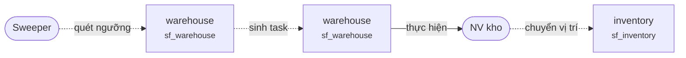

| # | Service | Ghi vào | Kết quả |
|---|---|---|---|
| 01 | `warehouse` | `đọc replenishment_rule` | ngưỡng min/max mỗi vị trí nhặt |
| 02 | `warehouse` | `+ replenishment_task` | status = CREATED, chọn vị trí nguồn |
| 03 | `warehouse` | `~ replenishment_task.priority` | theo mức cạn |
| 04 | `warehouse` | `~ replenishment_task, + outbox_event` | → COMPLETED |
| 05 | `inventory` | `~ stock_item.location_code, + stock_movement` | chuyển vị trí trong cùng kho |

> · Nguồn lấy từ khu dự trữ, đích là vị trí nhặt hàng. Cùng một kho nên KHÔNG qua in_transit.
> · Task được ưu tiên theo mức cạn của vị trí nhặt — WBS 3.11.4.

---

## `F-CNT` Kiểm kê và điều chỉnh tồn

*WBS 3.6.6*

Chỗ duy nhất trong hệ thống mà một con số có thể ghi đè tồn kho. Vì vậy nó bắt buộc phải qua duyệt.

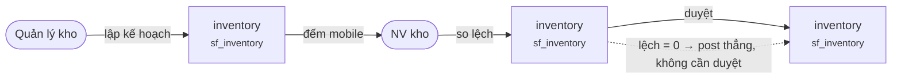

| # | Service | Ghi vào | Kết quả |
|---|---|---|---|
| 01 | `inventory` | `+ cycle_count, + cycle_count_line × N` | status = PLANNED |
| 02 | `inventory` | `~ cycle_count.status` | → COUNTING |
| 03 | `inventory` | `~ cycle_count_line.counted_qty` | đếm bằng mobile, quét vị trí |
| 04 | `inventory` | `+ count_variance` | so counted vs on_hand |
| 05 | `inventory` | `+ stock_adjustment` | → VARIANCE_REVIEW, chờ duyệt |
| 06 | `inventory` | `~ stock_item.on_hand, + stock_movement` | → POSTED sau khi duyệt |

> ★ Mọi chênh lệch đều cần duyệt của quản lý kho trước khi chạm vào tồn — BR-STK-005.
> · Điều chỉnh vượt ngưỡng giá trị cấu hình thì cần cấp duyệt cao hơn.

---

## `F-EXP` Quét hết hạn hằng đêm

*WBS 3.6.7*

Job chạy 1 lần mỗi đêm. Không có nó thì hàng quá hạn vẫn nằm trong ATP và vẫn bán được.

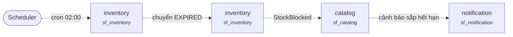

| # | Service | Ghi vào | Kết quả |
|---|---|---|---|
| 01 | `inventory` | `quét stock_item WHERE expiry_date < today` | điều kiện BR-STK-004 |
| 02 | `inventory` | `~ stock_item.condition = EXPIRED` | rơi khỏi ATP |
| 03 | `inventory` | `+ stock_movement, + outbox_event` | StockBlocked(EXPIRED) |
| 04 | `catalog` | `~ atp_cache` | số hiển thị giảm |
| 05 | `notification` | `+ notification` | báo quản lý kho danh sách lô hết hạn |

> · expiry_date < hôm nay → condition = EXPIRED, rơi khỏi ATP ngay lập tức — BR-STK-004.
> · Hàng sắp hết hạn (trong N ngày) thì chỉ cảnh báo, chưa chặn bán.

---


# Sau bán hàng

## `F-RMA` Trả hàng và đổi hàng

*WBS 3.17.5*

Hàng trả về LUÔN vào trạng thái cách ly, không bao giờ thẳng vào GOOD. Bán lại được hay không là quyết định của QC.

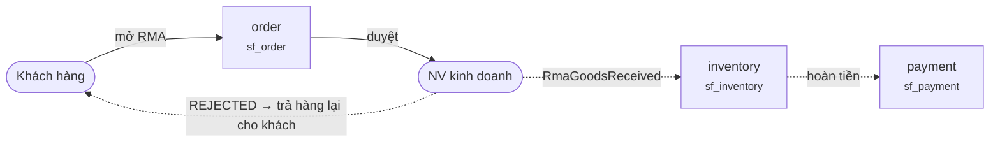

| # | Service | Ghi vào | Kết quả |
|---|---|---|---|
| 01 | `order` | `+ rma, + rma_line × N, ~ order.status` | → REQUESTED · RETURN_REQUESTED |
| 02 | `order` | `~ rma.approved_by` | → APPROVED, kiểm BR-RMA-002 |
| 03 | `fulfillment` | `+ return_shipment, MinIO + labels/return-*.pdf` | nhãn chiều về |
| 04 | `procurement` | `+ return_receipt, + qc_task` | đối chiếu số RMA trên kiện |
| 05 | `inventory` | `+ stock_item condition = QUARANTINE, + stock_movement` | KHÔNG BAO GIỜ là GOOD |
| 06 | `procurement` | `+ qc_result` | ACCEPTED → GOOD · REJECTED → DAMAGED |
| 07 | `payment` | `+ refund, ~ payment.status, + outbox_event` | → REFUNDED · RefundCompleted |
| 08 | `order` | `~ rma, ~ order.status` | → RETURNED |

> ⚠ Hàng in theo yêu cầu KHÔNG được trả trừ khi lỗi — BR-RMA-002. Cốc in ảnh của khách không bán lại cho ai được.
> · Hàng in bị lỗi trả về thì vào thẳng DAMAGED, không phải QUARANTINE — không có gì để kiểm lại.

---

## `F-RTO` Hàng hoàn về vì giao không thành công

*WBS 3.9.7*

Khác RMA ở chỗ khách chưa từng nhận hàng. Nhưng hàng vẫn phải qua kiểm mới bán lại được.

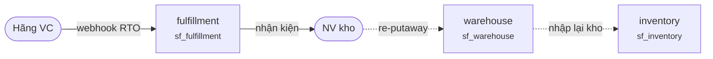

| # | Service | Ghi vào | Kết quả |
|---|---|---|---|
| 01 | `fulfillment` | `~ shipment.tracking_status, + tracking_event` | → RTO_IN_TRANSIT |
| 02 | `fulfillment` | `~ shipment.status` | → RTO_RECEIVED |
| 03 | `order` | `~ order.status, + order_status_history` | → RTO |
| 04 | `warehouse` | `+ putaway_task` | tái xếp kho |
| 05 | `inventory` | `+ stock_item, + stock_movement` | GOOD nếu kiện nguyên, QUARANTINE nếu không |

> · Kiện còn nguyên → condition = GOOD. Kiện rách hoặc mở → QUARANTINE — OQ-12.
> · Đơn → RTO là trạng thái kết thúc; hoàn tiền cho khách xử lý riêng qua luồng refund.

---

## `F-REF` Hoàn tiền và đối soát với cổng thanh toán

*WBS 3.15.6 · 3.20.4*

Tiền ra khỏi hệ thống. Hạn mức duyệt là thứ chặn duy nhất, nên nó phải kiểm trong domain chứ không ở controller.

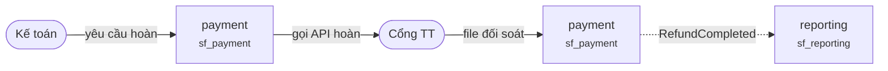

| # | Service | Ghi vào | Kết quả |
|---|---|---|---|
| 01 | `payment` | `+ refund` | status = REQUESTED |
| 02 | `payment` | `~ refund.approved_by` | kiểm hạn mức duyệt |
| 03 | `payment` | `+ payment_transaction` | payload gọi API hoàn tiền |
| 04 | `payment` | `~ payment.status` | → PARTIALLY_REFUNDED | REFUNDED |
| 05 | `payment` | `+ settlement_line` | import file đối soát của cổng |
| 06 | `payment` | `+ reconciliation_match` | khớp hoặc gắn cờ lệch |
| 07 | `reporting` | `~ revenue_report` | read model doanh thu |

> ⚠ Vượt hạn mức người duyệt thì KHÔNG hoàn được, phải chuyển lên cấp trên — BR-PAY-003.
> · Đối soát so ba nguồn: payment của mình, settlement của cổng, và remittance của hãng VC cho COD.

---


# Ngoại lệ

## `X-SHORT` Nhặt thiếu — đơn không hỏng, đơn dừng lại

*WBS 3.7.5*

Tình huống xảy ra hằng ngày ở kho thật. Điều quan trọng là đơn KHÔNG tự huỷ và tồn KHÔNG tự trừ.

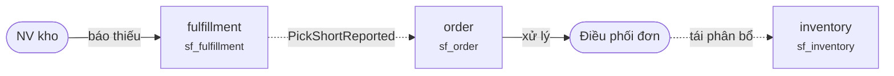

| # | Service | Ghi vào | Kết quả |
|---|---|---|---|
| 01 | `fulfillment` | `~ pick_line.status = SHORT, .short_qty` | + outbox_event |
| 02 | `order` | `~ order.status, + order_hold` | → ON_HOLD(INVENTORY_ISSUE) |
| 03 | `inventory` | `+ cycle_count (tự sinh)` | kiểm lại vị trí bị thiếu |
| 04 | `inventory` | `~ stock_allocation (nếu tái phân bổ)` | chọn vị trí khác |
| 05 | `order` | `~ order.status, + order_status_history` | → CONFIRMED, chạy lại luồng nhặt |

> ★ Dòng đơn → SHORT, đơn → ON_HOLD(INVENTORY_ISSUE). Không dòng stock_movement nào được ghi.
> · Điều phối chọn một trong ba: phân bổ lại từ vị trí khác, tách đơn, hoặc huỷ dòng đó.
> · Chênh lệch giữa allocated và thực tế nhặt được luôn kèm một cycle_count tự động cho vị trí đó.

---

## `X-RESV` Giữ chỗ hết hạn — tồn tự phục hồi

*WBS 3.14.5.2*

Không có job này thì mỗi khách bỏ giỏ hàng là một ít tồn bị khoá vĩnh viễn, và hệ thống dần tự bán hết hàng của chính mình.

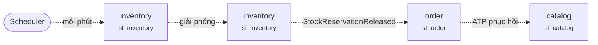

| # | Service | Ghi vào | Kết quả |
|---|---|---|---|
| 01 | `inventory` | `quét stock_reservation WHERE expires_at < now AND status = HELD` |  |
| 02 | `inventory` | `~ stock_reservation.status = RELEASED` | reason = RESERVATION_EXPIRED |
| 03 | `inventory` | `~ stock_item.reserved −, + outbox_event` | StockReservationReleased |
| 04 | `order` | `~ order.status` | → PAYMENT_FAILED |
| 05 | `catalog` | `~ atp_cache` | ATP phục hồi tự động |

> · expires_at < now → status = RELEASED, reason = RESERVATION_EXPIRED — BR-STK-002.
> · Đơn tương ứng → PAYMENT_FAILED. Giỏ hàng của khách được giữ lại để họ thử lại.
> ★ Allocation KHÔNG có expires_at — đã phân bổ rồi thì không tự hết hạn nữa.

---

## `X-CHK` Lệch checksum thiết kế — dừng đóng gói

*WBS 3.8.3*

Nghĩa là kiện hàng sắp chứa thứ khác với thứ khách đã duyệt. Đây là lỗi phải chặn, không phải cảnh báo.

```mermaid
flowchart LR
    N0(["NV kho"])
    N1["fulfillment<br><small>sf_fulfillment</small>"]
    N2["design<br><small>sf_design</small>"]
    N3["order<br><small>sf_order</small>"]
    N4(["NV kinh doanh"])
    N0 -->|"quét kiện"| N1
    N1 -->|"verify checksum"| N2
    N2 -.->|"MISMATCH"| N3
    N3 -.->|"xử lý"| N4
```

| # | Service | Ghi vào | Kết quả |
|---|---|---|---|
| 01 | `fulfillment` | `+ design_verification` | expected_checksum vs actual |
| 02 | `design` | `đọc design-snapshots/{id}.json` | tính lại SHA-256 |
| 03 | `fulfillment` | `~ design_verification.result = MISMATCH` | + outbox_event |
| 04 | `order` | `~ order.status, + order_hold` | → ON_HOLD, reason = DESIGN_MISMATCH |
| 05 | `order` | `~ order_line.design_snapshot_id (nếu cần in lại)` | BR-DSG-002 |

> · So checksum lưu trên order_line với artifact thật trong MinIO — BR-DSG-003.
> ⚠ Lệch thì đơn → ON_HOLD, và phải người có quyền mới giải quyết được. Không có nút bỏ qua.

---


# Nền tảng

## `P-PERM` 14 service tự đăng ký catalog phân quyền

*WBS 3.19.1*

Cơ chế làm cho con số 387 quyền là số ĐƯỢC TÍNH RA, không phải danh sách ai đó phải nhớ cập nhật.

```mermaid
flowchart LR
    N0(["mỗi service"])
    N1(["@PermissionResource"])
    N2["identity<br><small>sf_identity</small>"]
    N3["identity<br><small>sf_identity</small>"]
    N4(["Màn hình admin"])
    N0 -.->|"khi khởi động"| N1
    N1 -->|"POST register"| N2
    N2 -.->|"upsert"| N3
    N3 -->|"ma trận"| N4
```

| # | Service | Ghi vào | Kết quả |
|---|---|---|---|
| 01 | `service` | `quét @PermissionResource bằng reflection` | dựng PermissionCatalog |
| 02 | `service` | `đối chiếu @RequiresPermission` | lệch → chặn khởi động |
| 03 | `identity` | `+ permission_resource (upsert)` | code, group, route, api_path |
| 04 | `identity` | `+ permission (upsert)` | một dòng cho mỗi (resource, action) |
| 05 | `identity` | `~ permission_version` | tăng counter, token cũ bị từ chối |
| 06 | `identity` | `→ trả RoleMatrixView cho màn hình` | đã gom nhóm và tính counter |

> ⚠ Endpoint đòi quyền mà không resource nào khai báo thì service KHÔNG KHỞI ĐỘNG ĐƯỢC — BR-SEC-001.
> · Service chưa chạy thì quyền của nó tạm chưa hiện trên màn hình. Tự chữa lành, không cần seed script.

---

## `P-NOTI` Thông báo — một event, nhiều kênh

*WBS 3.19.2*

notification-service nghe gần như mọi topic. Đây là lý do nó không được phép có logic nghiệp vụ nào.

```mermaid
flowchart LR
    N0(["mọi service"])
    N1[("Kafka")]
    N2["notification<br><small>sf_notification</small>"]
    N3(["Template engine"])
    N4(["Email / SMS / In-app"])
    N0 -.->|"outbox"| N1
    N1 -.->|"consumer"| N2
    N2 -->|"render"| N3
    N3 -->|"gửi"| N4
```

| # | Service | Ghi vào | Kết quả |
|---|---|---|---|
| 01 | `notification` | `+ processed_event` | chống trùng |
| 02 | `notification` | `+ notification` | channel, recipient, template_code |
| 03 | `notification` | `render template + biến` | Thymeleaf |
| 04 | `notification` | `~ notification.status` | SENT | FAILED |
| 05 | `notification` | `+ notification_attempt` | nhật ký từng lần gửi |

> · Consumer phải idempotent: cùng một event giao hai lần không được gửi hai email — BR-SEC-001 áp dụng chung.
> · Gửi thất bại thì lưu lại và cho phép gửi lại thủ công, không im lặng bỏ qua.

---

## `P-RPT` Read model báo cáo dựng từ event stream

*WBS 3.20*

reporting-service không gọi API của ai cả. Nó chỉ nghe event và tự dựng bảng của mình — vì thế nó không làm chậm hệ thống chính.

```mermaid
flowchart LR
    N0(["mọi service"])
    N1[("Kafka")]
    N2["reporting<br><small>sf_reporting</small>"]
    N3["reporting<br><small>sf_reporting</small>"]
    N4(["Dashboard"])
    N0 -.->|"outbox"| N1
    N1 -.->|"projector"| N2
    N2 -.->|"tổng hợp đêm"| N3
    N3 -->|"truy vấn"| N4
```

| # | Service | Ghi vào | Kết quả |
|---|---|---|---|
| 01 | `reporting` | `+ processed_event` | chống trùng |
| 02 | `reporting` | `+ projection (một bảng phẳng mỗi loại báo cáo)` | denormalise sẵn |
| 03 | `reporting` | `+ kpi_daily` | job tổng hợp chạy đêm |
| 04 | `reporting` | `→ trả dashboard` | truy vấn một bảng, không JOIN |

> ★ Không có JOIN xuyên database — đây chính là câu trả lời cho 'vậy báo cáo lấy dữ liệu ở đâu' — ADR-0002.
> · Read model có thể dựng lại từ đầu bằng cách replay event, nên sai sót projector là sửa được.

---

## `P-CHAT` Chat tư vấn dẫn tới đơn hàng đặt hộ

*WBS 3.16*

Luồng duy nhất mà nhân viên thao tác thay mặt khách. Quyền và dấu vết ai làm gì phải rõ.

```mermaid
flowchart LR
    N0(["Khách hàng"])
    N1["chat<br><small>sf_chat</small>"]
    N2(["NV kinh doanh"])
    N3["design<br><small>sf_design</small>"]
    N4["order<br><small>sf_order</small>"]
    N0 -->|"WebSocket"| N1
    N1 -->|"định tuyến"| N2
    N2 -->|"sửa thiết kế hộ"| N3
    N3 -->|"đặt đơn hộ"| N4
```

| # | Service | Ghi vào | Kết quả |
|---|---|---|---|
| 01 | `chat` | `+ conversation, + message` | status = OPEN |
| 02 | `chat` | `~ conversation.assigned_to` | theo routing rule |
| 03 | `chat` | `+ message (rich: ảnh, link sản phẩm)` |  |
| 04 | `design` | `+ design_draft (nhân viên tạo hộ)` | khách vẫn phải confirm |
| 05 | `order` | `+ order, created_by = nhân viên` | customer_id vẫn là khách |
| 06 | `chat` | `~ conversation.status` | → RESOLVED |

> ★ Đơn đặt hộ vẫn ghi customer_id của khách, nhưng created_by là nhân viên — audit phải phân biệt được.
> · Nhân viên sửa thiết kế hộ khách thì khách vẫn phải confirm lại snapshot mới.

---


# Quy ước lưu trữ

**Chỉ ghi thêm — không bao giờ UPDATE hay DELETE**
`stock_movement`, `order_status_history`, `payment_transaction`, `tracking_event`, `qc_result`,
`outbox_event`, `audit_log`. Sai thì ghi một dòng đảo ngược.

**Bất biến sau khi tạo**
`design_snapshot` và artifact JSON của nó, `order_line` sau khi đơn rời CONFIRMED, mọi chứng từ
đã post.

**Sửa thoải mái**
`stock_item`, `cart_item`, `design_draft` khi còn DRAFT, các bảng cấu hình. Nhưng mọi thay đổi
số lượng tồn đều phải kèm một dòng `stock_movement`.

**Job đối chiếu nên có**
Tổng các dòng `stock_movement` của một SKU tại một vị trí phải bằng đúng `stock_item.on_hand`.
Chạy hằng đêm.
