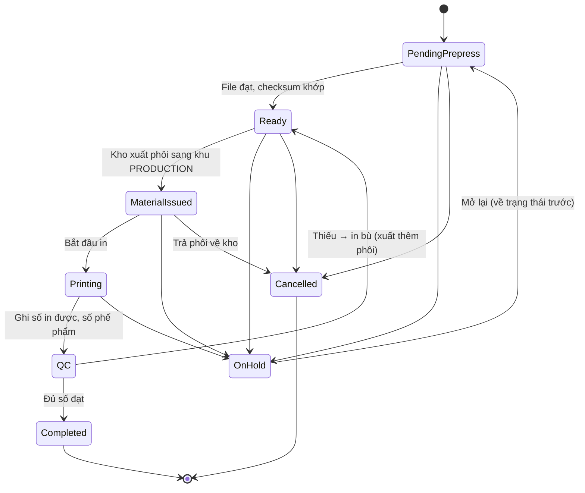

# Kế hoạch 2026-10-06 — Chuyển sang bán sỉ (B2B) và luồng sản xuất (mẫu + đơn hàng)

> **Đã duyệt 2026-10-06.** Jira: epic SCRUM-393 (story 394–402, subtask 403–420), task chặn SCRUM-421–425,
> story B2B mới SCRUM-426–429. Docs theo §7 đã sửa trong working tree (chưa commit).
> **Bổ sung cùng ngày:** gia công ngoài (§8, SCRUM-433, 434, 441, 442) và màn hình FE kho / đơn cho Hưng, Vũ (§9, SCRUM-435–440, 443).

---

## 1. Quyết định đã chốt (2026-10-06)

| # | Quyết định |
|---|---|
| D1 | **Chỉ bán sỉ (B2B)** cho khách đã liên hệ từ trước. Bỏ guest checkout và đăng ký tự do. |
| D2 | Khách đặt đơn theo **cả hai cách**: Sale tạo đơn từ báo giá đã chấp nhận, **và** khách tự đặt trên cổng khách hàng theo giá riêng. |
| D3 | Thanh toán: **đặt cọc** trước khi sản xuất, **công nợ có hạn mức**, **chuyển khoản trả trước 100%**. Mỗi khách được cấu hình phương thức nào được dùng. |
| D4 | **Sản xuất mẫu bắt buộc với thiết kế mới**; đặt lại thiết kế đã có mẫu được duyệt thì không cần làm mẫu. |
| D5 | Sản phẩm sản xuất: **in ly và bao bì** theo thiết kế của khách. Không phải nội thất. |
| D6 | Code sản xuất nằm trong **module `production` riêng**. Không đặt trong `fulfillment`. |
| D7 | Phôi được **xuất sang khu `PRODUCTION`** (loại khu mới), không in tại chỗ. |
| D8 | Giao trọn luồng sản xuất (BE + FE), từ yêu cầu làm mẫu đến khi sản xuất xong, cho **Hoàng Minh Võ**. |
| D9 | Lệnh sản xuất đơn hàng sinh khi **Order Coordinator release đơn** (docs 17, bước 5), không sinh ngay lúc `Confirmed` — phải chọn kho xuất xong mới biết phôi và xưởng ở đâu. |
| D10 | **Gia công ngoài** khi xưởng nội bộ thiếu công suất: Quản lý kho **tách một phần** LSX thành LSX con gia công (LSX gốc giữ nguyên trạng thái). |
| D11 | Gia công theo **cả hai cách**, chọn mỗi lần tách: `SUPPLIED_BLANKS` (mình cấp phôi, trả phí gia công) và `FULL_SERVICE` (nhà gia công lo phôi, mình mua thành phẩm). |
| D12 | **Chỉ LSX `ORDER`** được gia công; LSX `SAMPLE` luôn in nội bộ. |

> ⚠️ **Đây là đổi phạm vi so với buổi review 1** (pitch kể theo B2C: "khách đặt 1 cốc in logo"). Cần báo thầy Sang trước khi sửa tài liệu.

---

## 2. Luồng B2B đầu-cuối

```mermaid
flowchart LR
    A[Khách liên hệ] --> B[Sale tạo hồ sơ khách<br/>phương thức thanh toán, hạn mức]
    B --> C[Báo giá]
    C --> D{Thiết kế mới?}
    D -- Có --> E[Yêu cầu làm mẫu]
    E --> F[Sản xuất mẫu]
    F --> G{Khách duyệt mẫu?}
    G -- Yêu cầu sửa --> E
    G -- Duyệt --> H[Khách chấp nhận báo giá]
    D -- Không, đã có mẫu duyệt --> H
    P[Khách tự đặt trên cổng<br/>theo giá riêng] --> I
    H --> I[Đơn bán]
    I --> J{Thanh toán}
    J -- Cọc / trả trước --> K[Chờ tiền về]
    J -- Công nợ --> L{Trong hạn mức?}
    L -- Không --> M[On Hold: chờ duyệt vượt hạn mức]
    L -- Có --> N
    K --> N[Confirmed]
    M --> N
    N --> O[Coordinator chọn kho, release]
    O --> Q[Sản xuất đơn hàng]
    O --> R[Dòng hàng sẵn: Picking]
    Q --> S[Đóng gói: QC theo mẫu đã duyệt]
    R --> S
    S --> T[Xếp xe → Bàn giao → Giao]
    T --> U[Thu phần còn lại / ghi công nợ]
```

---

## 3. Sản xuất: hai loại, chung một xưởng

### 3.1. So sánh

| | Sản xuất mẫu (`SAMPLE`) | Sản xuất đơn hàng (`ORDER`) |
|---|---|---|
| Sinh ra từ | **Yêu cầu làm mẫu** (gắn khách + báo giá), chưa có đơn bán | Dòng tuỳ chỉnh của **đơn bán** đã được release |
| Số lượng | Vài cái | Theo đơn |
| Phôi | Giữ chỗ theo yêu cầu mẫu; xuất kho với lý do `SAMPLE` (tính chi phí làm mẫu) | Phôi đã giữ cho đơn |
| QC đối chiếu với | File thiết kế (`PRINT_READY`) | **Mẫu đã được khách duyệt** |
| Kết thúc | Gửi mẫu cho khách → khách duyệt hoặc yêu cầu sửa | Thành phẩm sang khu `PACKING`, đơn sẵn sàng đóng gói |

Các bước tại xưởng giống nhau: **kiểm file → xuất phôi → in → QC → (in bù) → hoàn tất**.

### 3.2. Yêu cầu làm mẫu (Sample Request)

| Trạng thái | Ý nghĩa | Chuyển tiếp | Ai |
|---|---|---|---|
| `Draft` | Sale soạn: khách, phôi (SKU), thiết kế, số lượng mẫu, hạn | → `Submitted`, → `Cancelled` | Sale |
| `Submitted` | Đã gửi xưởng, sinh lệnh sản xuất `SAMPLE` | → `In Production` | Hệ thống |
| `In Production` | Xưởng đang làm mẫu | → `Ready` | Xưởng |
| `Ready` | Mẫu xong, QC đạt | → `Sent to Customer` | Xưởng / Sale |
| `Sent to Customer` | Đã gửi hoặc bàn giao mẫu cho khách | → `Approved`, → `Changes Requested` | Khách (trên cổng) / Sale ghi nhận |
| `Changes Requested` | Khách yêu cầu sửa, kèm góp ý | → `Draft` (lần mẫu tiếp theo, tăng số lần) | Sale |
| `Approved` | Khách duyệt: **khoá thiết kế**, làm chuẩn QC cho đơn hàng | *(cuối)* | Khách / Sale |
| `Cancelled` | Huỷ | *(cuối)* | Sale |

### 3.3. Lệnh sản xuất (LSX)

Lý do `On Hold`: file lỗi, thiếu phôi, máy hỏng, chờ khách xác nhận.

### 3.4. Quy tắc nghiệp vụ

- **BR-PRD-01** — Mỗi dòng tuỳ chỉnh của đơn (hoặc mỗi yêu cầu mẫu) có đúng 1 LSX. Tạo lại không sinh LSX trùng.
- **BR-PRD-02** — Không được in khi chưa qua kiểm file hoặc checksum không khớp thiết kế đã khoá.
- **BR-PRD-03** — Chỉ xuất phôi theo LSX, và không vượt số còn thiếu.
- **BR-PRD-04** — Số đạt + số phế = số đã in. Phế phẩm bắt buộc có lý do; phôi hỏng trừ tồn bằng điều chỉnh có lý do, không trừ âm thầm.
- **BR-PRD-05** — Phải qua QC mới được `Completed`. LSX `ORDER` QC theo **mẫu đã duyệt**.
- **BR-PRD-06** — Đơn chỉ rời `In Production` khi mọi LSX của đơn đã `Completed` (hoặc dòng đó đã huỷ).
- **BR-PRD-07** — Không đổi thiết kế sau khi LSX đã sang `Printing`.
- **BR-PRD-08** — Dòng đơn có **thiết kế mới** (chưa có mẫu `Approved` cho cặp thiết kế + phôi) **không được release** sang sản xuất.
- **BR-PRD-09** — Đơn đặt cọc chỉ được release sang sản xuất khi tiền cọc đã về.
- **BR-PRD-10** — Huỷ khi LSX đã `Printing`: theo chính sách docs 17 (từ chối huỷ, hoặc huỷ có tính phí sản xuất).

> ⚠️ Giả định (ghi vào open-questions):
> - Bản đầu xếp hàng đợi theo hạn và thời điểm release; không tính công suất máy.
> - Không xuất dư phôi để bù hao hụt; hao hụt được bù bằng in bù.
> - Mẫu gửi cho khách bằng bàn giao trực tiếp hoặc chuyển phát ngoài hệ thống; hệ thống chỉ ghi nhận đã gửi.
> - Phí làm mẫu: chưa chốt (miễn phí, hoặc tính vào báo giá).

### 3.5. Vai trò

- **Nhân viên xưởng in (Production Staff)** — mới: kiểm file, bắt đầu in, ghi số in được và phế phẩm.
- **QC Staff** — QC thành phẩm và mẫu (đã có trong docs; mở rộng phạm vi).
- **Warehouse Staff** — xuất phôi sang khu `PRODUCTION`; chuyển thành phẩm sang `PACKING`.
- **Sales Staff** — tạo yêu cầu mẫu, ghi nhận khách duyệt hoặc yêu cầu sửa.
- **Warehouse Manager** — xử lý `On Hold` (thiếu phôi, máy hỏng).

### 3.6. Hai module nói chuyện qua sự kiện (trong `contracts`)

| Sự kiện | Phát từ | Nghe ở | Mục đích |
|---|---|---|---|
| `OrderLinesReleasedForProduction` | order | production | Sinh LSX `ORDER` |
| `ProductionCompleted` | production | order | Đơn → `Ready to Fulfill` khi đủ mọi dòng |
| `SampleApproved` | production | order / quote | Mở khoá release cho thiết kế mới (BR-PRD-08) |

Chốt nội dung 3 sự kiện này trước thì Tú và Võ code song song được.

---

## 4. Tác động lên các ticket hiện có

| Ticket | Người làm | Đề xuất | Lý do |
|---|---|---|---|
| SCRUM-192 Voucher & Promotion | Phương | **Tạm dừng / đóng** | B2B dùng giá theo báo giá và giá riêng từng khách |
| SCRUM-215 Payment Gateway | Tú | **Tạm dừng** | B2B thanh toán bằng chuyển khoản |
| SCRUM-218 COD | Tú | **Đổi** thành "Thu phần còn lại khi giao" | B2B không thu hộ qua hãng như bán lẻ |
| SCRUM-220 Refund | Phương | **Thu hẹp** | Chỉ hoàn với đơn huỷ đã cọc hoặc hàng lỗi sản xuất |
| SCRUM-173 SEO & Metadata | Hưng | **Đóng** | Cổng khách hàng nằm sau đăng nhập, không cần SEO |
| SCRUM-172 Pricing & Promotions Display | Phương | **Đổi** thành "Hiển thị giá riêng theo khách" | |
| SCRUM-168 / 169 PLP / PDP | Hưng / Vũ | **Giữ, đổi ngữ cảnh** | Catalog trên cổng khách hàng (đăng nhập), giá riêng |
| SCRUM-190 Cart | Tú | **Đổi** thành "Đặt hàng nhanh / đặt lại trên cổng" | D2: khách tự đặt |
| SCRUM-193 Checkout | Tú | **Đổi** | Chọn phương thức (cọc / công nợ / trả trước), kiểm hạn mức |
| SCRUM-195 Order Creation | Phương | **Mở rộng** | Thêm tạo đơn từ báo giá đã chấp nhận |
| SCRUM-217 Bank Transfer | Phương | **Tăng ưu tiên** | Thành phương thức chính |
| SCRUM-219 Deposit | Võ | **Tăng ưu tiên** | Điều kiện để release sản xuất (BR-PRD-09) |
| SCRUM-240 Order Release & Sourcing | Võ | **Giữ** | Chính là điểm sinh LSX `ORDER` |
| SCRUM-243 RMA | Võ | **Thu hẹp** | Chỉ đổi trả khi lỗi sản xuất |
| SCRUM-296 "2D Furniture Layout Designer" | Võ | **Đổi tên** thành "2D Cup & Packaging Designer" | Sai sản phẩm |
| SCRUM-298 Save Design & Convert to Quote/Order | Tú | **Giữ** | Rất khớp với B2B |
| SCRUM-245 Customer Order Portal | Tú | **Giữ, tăng ưu tiên** | Cổng là kênh chính của khách sỉ |
| SCRUM-46 Customer Profile (Done) | Võ | **Task mới** | Thay đăng ký tự do bằng Sale tạo khách / mời kích hoạt |
| SCRUM-158 Storefront ATP (nhánh chưa merge) | Tú | **Đổi** | Endpoint `/public/` → yêu cầu đăng nhập khách |
| Guest checkout (code đã có trên develop) | — | **Tắt** | D1 |

**Việc mới chưa có ticket:**
- **Báo giá (Quotation)** — đã có một phần trong PR #38 (`DesignQuote`). Cần chọn người làm.
- **Công nợ phải thu và hạn mức tín dụng của khách** — hoàn toàn mới: hạn mức, kỳ hạn, dư nợ, chặn khi vượt.
- **Giá riêng theo khách / hợp đồng** — schema mới có `pricing_rule` theo nhóm khách, chưa có theo từng khách.

---

## 5. Jira cho Võ — Epic "Sản xuất in ly & bao bì (WBS 3.25)"

Mỗi story có 1 subtask BE và 1 subtask FE, cùng giao cho Võ.

| # | Story | BE | FE | Chờ |
|---|---|---|---|---|
| 1 | Yêu cầu làm mẫu & khách duyệt mẫu | Aggregate Sample Request, vòng đời §3.2, khoá thiết kế khi duyệt, phát `SampleApproved` | Sale: tạo và theo dõi yêu cầu; Khách: duyệt / yêu cầu sửa trên cổng | T2, T5 |
| 2 | Sinh lệnh sản xuất (`SAMPLE` + `ORDER`) | Sinh LSX từ yêu cầu mẫu và từ `OrderLinesReleasedForProduction`; BR-PRD-01, 08, 09 | Danh sách LSX, lọc theo loại | T2, T3, T5 |
| 3 | Kiểm file (prepress) & treo lệnh | Tải `PRINT_READY` qua `design :: api`, kiểm checksum, `On Hold` kèm lý do | Chi tiết LSX: xem/tải file, treo / mở lại | T2 |
| 4 | Xuất phôi sang khu sản xuất | Yêu cầu xuất phôi, xác nhận quét; BR-PRD-03 | Màn quét xuất phôi | **T4** |
| 5 | In, phế phẩm & in bù | Ghi số in và phế phẩm có lý do, điều chỉnh tồn, quay lại `Ready` khi thiếu; BR-PRD-04 | Bảng Kanban xưởng | T4 |
| 6 | QC thành phẩm & mẫu | QC đạt / không đạt; `ORDER` đối chiếu mẫu đã duyệt; BR-PRD-05 | Màn QC (ảnh mẫu đã duyệt cạnh thành phẩm) | — |
| 7 | Hoàn tất & bàn giao | `SAMPLE` → yêu cầu mẫu `Ready`; `ORDER` → chuyển thành phẩm sang `PACKING`, phát `ProductionCompleted` | Danh sách đã xong | T4, T5 |
| 8 | Huỷ & ngoại lệ | Huỷ theo BR-PRD-10, trả phôi, thiếu phôi, máy hỏng | Thao tác huỷ / treo | — |
| 9 | Phân quyền & dashboard xưởng | Resource quyền `production-orders`, `sample-requests`; role Production Staff | Dashboard: đang làm, trễ hạn, tỷ lệ phế phẩm | T2 |

**Tải của Võ:** đang giữ 8 task Sprint 2, PR #36 và #38 đang conflict, cùng SCRUM-288 và 327. Đề xuất chuyển SCRUM-288 (bàn giao hãng) và SCRUM-327 (chuyển kho) cho người khác.

---

## 6. Task chặn cho Tú (làm trong 1–2 ngày đầu sprint)

| # | Task | Mở khoá cho |
|---|---|---|
| T1 | Tài liệu: luồng `F-PROD` và `F-SAMPLE`, các thay đổi B2B (§7) | Tất cả |
| T2 | Migration: schema `production` (LSX, lịch sử, QC, phế phẩm, yêu cầu mẫu); trạng thái đơn `IN_PRODUCTION`; loại khu `PRODUCTION` trong CHECK của `V20260928000100`; seed role Production Staff và quyền | Story 1, 2, 3, 9 |
| T3 | Module order: trạng thái `IN_PRODUCTION`, release phát `OrderLinesReleasedForProduction`, nghe `ProductionCompleted` | Story 2, 7 |
| T4 | Module inventory: API **xuất / chuyển tồn** và **điều chỉnh có lý do** (cũng gỡ chặn putaway của Phương) | Story 4, 5, 7 |
| T5 | `contracts`: 3 sự kiện ở §3.6 | Story 1, 2, 7 |

---

## 7. Tài liệu cần cập nhật khi được duyệt

**kltn-docs**
- Module mới `docs/warehouse/19-production/README.md` (7 mục chuẩn).
- `README.md`, `docs/README.md`.
- `00-system-overview`: bối cảnh B2B, role Production Staff, module map, bảng luồng, sơ đồ end-to-end.
- `diagrams`; `glossary`: LSX, phôi, prepress, phế phẩm, mẫu, khu `PRODUCTION`, báo giá, công nợ phải thu.
- `open-questions`:
  - đóng B1, B2, G5;
  - chốt B9;
  - thêm các giả định ở §3.4.
- `06-map`: thêm khu `PRODUCTION`, sửa BR-11. `07-picking`: BR-06 và edge case. `08-packing`: QC theo mẫu đã duyệt.
- `12-product-design`: thiết kế được khoá khi mẫu được duyệt.
- `13-catalog`: chỉ khách đã đăng nhập, giá riêng.
- `14-cart-and-order`: báo giá → đơn, khách tự đặt; bỏ guest.
- `15-payment`: cọc, công nợ, chuyển khoản; bỏ cổng thanh toán và COD bán lẻ.
- `16-sales-chat`: báo giá và yêu cầu mẫu.
- `17-order-management`: release → sản xuất; giữ đơn khi vượt hạn mức.
- `18-customer-information`: Sale tạo khách; hạn mức, kỳ hạn; bỏ guest và đăng ký tự do.

**BE `docs/business-design`**
- `04c-all-flows`: thêm `F-PROD`, `F-SAMPLE`; sửa `F-CART`, `F-PAY`.
- `03-state-machines`: LSX, yêu cầu mẫu, đơn `IN_PRODUCTION`, giữ đơn vì tín dụng.
- `05-business-rules`: BR-PRD-01..10, quy tắc hạn mức.
- `06-open-questions`: OQ-05 → module `production` riêng.

**Repo BE (ngoài docs):** sửa các chỗ ghi "furniture" (`CLAUDE.md`, `README.md`, ADR-0005, comment trong `I18nConfig`, `StockAllocator`, `Product`, `CreateProductRequest`).

---

## 8. Bổ sung 2026-10-06 — Gia công ngoài

Chi tiết nghiệp vụ: `kltn-docs/docs/warehouse/19-production` §4.4, BR-11..17. Phía BE: `03-state-machines` §16, `04c-all-flows` F-PROD "Nhánh gia công ngoài", `05-business-rules` BR-PRD-11..17.

- **Tách:** LSX gốc (`Pending Prepress` / `Ready` / `On Hold`) giảm số lượng; LSX con `SUBCONTRACTED` kế thừa thiết kế, mẫu đã duyệt, kết quả kiểm file. Hệ thống sinh **PO gia công** (`SUBCONTRACT`).
- **Gửi đi:** chỉ khi PO đã duyệt. Mình cấp phôi → phôi chuyển sang vị trí ảo "tại nhà gia công", vẫn là tồn của mình, không tính ATP.
- **Nhận về:** phiếu nhận theo PO gia công; đối soát phôi; hao hụt vượt mức (mặc định 2%) → Quản lý kho duyệt, trừ vào hoá đơn. `GoodsReceiptPosted` → LSX con `QC` → `Completed`.
- **Trả tiền:** theo số đạt QC (giả định B15).

| Ticket | Nội dung | Người |
|---|---|---|
| SCRUM-433 | Story gia công (sub 441 BE, 442 FE) | Võ |
| SCRUM-434 | [T6] Loại PO `SUBCONTRACT`, cờ nhà gia công, hạn mức hao hụt | Tú |
| SCRUM-422 / 424 | Mở rộng phạm vi (comment): cột gia công trên LSX, vị trí ảo, đối soát; chuyển phôi sang nhà gia công | Tú |

## 9. Bổ sung 2026-10-06 — Màn hình FE còn thiếu cho Hưng và Vũ

Các trang kho trên FE (`receipts`, `picking`, `packing`, `putaway`, `inventory`, `orders`…) chỉ là trang giữ chỗ dựng ngày 11/9, chưa gọi API. Epic **Goods Receipt (SCRUM-23)** chưa có story nào, cả BE lẫn FE.

| Ticket | Màn hình | Người | API |
|---|---|---|---|
| SCRUM-435 | Nhận hàng theo PO — **BE** (kể cả nhận hàng gia công, phát `GoodsReceiptPosted`) | Tú | Schema đã có |
| SCRUM-436 | Nhập kho — FE | Hưng | chờ 435 |
| SCRUM-437 | Xuất kho: pick & pack — FE | Hưng | **đã có** (`/fulfillment/tasks`) |
| SCRUM-438 | Tồn kho: mức tồn, lô, ATP, giữ chỗ — FE | Vũ | **đã có** (`/inventory`) |
| SCRUM-439 | Điều chỉnh tồn, lịch sử nhập xuất, kiểm kê — FE | Vũ | chờ 424; kiểm kê chờ 146 |
| SCRUM-440 | Quản lý đơn hàng backoffice — FE (sub 443: API danh sách đơn cho admin, Tú) | Vũ | chờ 443, 423, 427 |

Bổ sung 2026-10-07, sau khi đối chiếu BE ↔ FE trong Sprint 2 (mỗi việc BE có màn FE đi kèm và ngược lại):

| Ticket | Nội dung | Người | Phụ thuộc |
|---|---|---|---|
| SCRUM-444 | FE: cấu hình mua hàng & kiểm soát tồn của sản phẩm, bảng giá theo khách | Vũ | BE 69, 70, 428 |
| SCRUM-445 | FE: xếp xe, bàn giao hãng, xuất lệnh điều chuyển | Hưng | BE 287, 288, 326, 327 |
| SCRUM-446 | FE: sửa PO và lịch sử phiên bản | Hưng | BE PO amendment |
| SCRUM-447 | FE: gợi ý sắp xếp lại vị trí (re-slotting) | Hưng | BE slotting |
| SCRUM-448 / 449 | Báo giá: BE (aggregate, bậc giá, chấp nhận, chuyển thành đơn) / FE (Sale + portal) | Võ | 426 |
| SCRUM-450 / 451 | Onboarding khách B2B: BE (Sale tạo khách, mời vào portal, tắt guest checkout) / FE | Võ | 429 |
