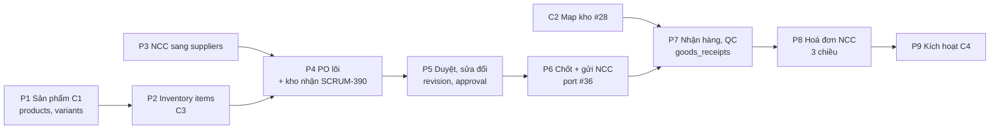

# Kế hoạch C4 — chuyển mảng mua hàng sang bảng mới

Ngày: 02/10/2026 · Người viết: Tú · Trạng thái: **nháp, cần cả nhóm chốt mục 4**

Liên quan:
- [migration plan 28/9](2026-09-28-migration-plan.md): §2 D3/D4/D7, §7 thứ tự merge, §8 bàn giao.
- [`db/pending/C4__contract_procurement.sql`](../../../src/main/resources/db/pending/C4__contract_procurement.sql)
- docs `02-purchase-order`, `03-receipt`, `04-invoice`
- SCRUM-390

---

## 1. Vì sao có kế hoạch này

**Điểm xuất phát:** SCRUM-390 thêm **kho nhận** cho PO. Docs 02 §3 ghi đây là trường bắt buộc.

- Bảng mới `procurement.purchase_orders` đã có `warehouse_id NOT NULL`.
- Code PO vẫn ghi vào bảng cũ `procurement.purchase_order`.
- Quy tắc DB số 5: *"Code mới viết trên bảng mới, không thêm tính năng vào bảng cũ"*.

Vì vậy kho nhận phải làm **sau khi PO chạy trên bảng mới**. Khi xem kỹ thì PO không chuyển một mình được: bảng mới của PO trỏ sang NCC mới, inventory item, revision và phiếu nhận. Tức là cả mảng mua hàng phải chuyển theo một thứ tự.

## 2. Hiện trạng (develop `6edb50b`)

| Nhóm | Bảng cũ (code đang map) | Bảng mới (đã có, chỉ có seed demo) |
|---|---|---|
| NCC | `procurement.supplier` | `suppliers`, `supplier_contacts`, `supplier_addresses`, `supplier_items`, `supplier_item_prices` |
| PO | `purchase_order`, `po_line` | `purchase_orders`, `purchase_order_lines`, `…_revisions`, `…_line_revisions`, `…_approvals`, `…_events`, `…_attachments`, `approval_limits` |
| Nhận hàng, QC | `goods_receipt`, `qc_result` | `goods_receipts`, `goods_receipt_lines`, `qc_inspections` |
| Hoá đơn NCC | `supplier_invoice` | `supplier_invoices`, `supplier_invoice_lines` |
| Mặt hàng kho | — (Võ đang lưu cấu hình ở `product.sku`, PR #38) | `inventory.inventory_items` |
| Sản phẩm | `product.product`, `variant`, `sku`… | `product.products`, `variants`… (C1) |

**Ràng buộc của bảng mới mà code hiện tại chưa đáp ứng:**

1. **NCC:** `purchase_orders.supplier_id → procurement.suppliers`. Code NCC (develop + #36) ghi bảng cũ → **không tạo được PO trên bảng mới** cho tới khi NCC chuyển xong.
2. **Dòng PO:** `purchase_order_lines.inventory_item_id → inventory.inventory_items`, mà `inventory_items.sku → product.variants.sku`.
   - Phụ thuộc C3 và C1.
   - Hiện chưa code nào ghi `inventory_items` hay `product.variants`; chỉ có seed demo.
3. **Trạng thái theo D4:** `DRAFT, PENDING_APPROVAL, APPROVED, CONFIRMED, PARTIALLY_RECEIVED, RECEIVED, CLOSED, CANCELLED`.
   - **Không có `SENT`**, nhưng #36 xây luồng gửi NCC trên `SENT`.
   - **Không có `CLOSED_SHORT`**; thay bằng `close_kind = SHORT_CLOSE`.
4. **Ra khỏi DRAFT phải có revision.** DB bắt buộc:
   - người gửi duyệt;
   - người duyệt **khác người gửi** (`ck_purchase_orders_four_eyes`);
   - người xác nhận.
   Đây là luồng duyệt và sửa đổi PO (SCRUM-114/117).
5. **Nhận hàng qua `goods_receipts`.** Trigger chỉ cho nhận khi PO `CONFIRMED`/`PARTIALLY_RECEIVED`, nhận đúng kho của PO, vào `storage_location` của kho đó (phụ thuộc C2, PR #28), và trong dung sai. Dòng PO không còn lưu số đã nhận. Endpoint `POST /purchase-orders/{id}/receipts` hiện tại sẽ bỏ.
6. **Không sửa được `po_number`, `supplier_id`, `warehouse_id`** sau khi tạo PO (`tg_purchase_orders_immutable`).
7. **Bảng mới còn thiếu cột cho tính năng #36:**
   - `suppliers`: chưa có `communication_channel`, `api_endpoint`, `payment_term_days` (int); `payment_terms` hiện là chuỗi.
   - `purchase_orders`: chưa có `sent_at`, `supplier_confirmation_status`, `supplier_reference`, `supplier_response_note`, `payment_term_days`/`lead_time_days` chụp lại lúc tạo.
   - → Cần **1 migration expand** (Tú viết).

## 3. Chuỗi phụ thuộc

**Viết code song song được.** Bảng mới đã có dữ liệu demo (1 NCC, 1 variant, 1 inventory item, 1 kho), nên P3, P4, P5 có thể code và test ngay trên DB demo, không cần đợi P1/P2. Chỉ **thứ tự merge và kích hoạt C4** mới phải theo đúng chuỗi trên.

## 4. Quyết định cần cả nhóm chốt

| Mã | Câu hỏi | Đề xuất |
|---|---|---|
| Q1 | `SENT` của #36 ứng với trạng thái nào trong D4 | **`CONFIRMED` = đã chốt và đã gửi NCC.** Docs 02 bước 9 "Chốt PO" là lúc khoá nội dung, đúng thời điểm gửi. Phản hồi của NCC (đồng ý / từ chối) **không đổi trạng thái PO**, lưu ở cột riêng và ghi `purchase_order_events`. |
| Q2 | `CLOSED_SHORT` | `CLOSED` + `close_kind = SHORT_CLOSE` + `close_reason`. Thêm `FORCE_CLOSE` (docs 02) từ `CONFIRMED`. |
| Q3 | Gửi duyệt và hạn mức | DRAFT → `PENDING_APPROVAL` luôn (bước *Submit*). Tổng PO ≤ hạn mức của vai trò người gửi (`approval_limits`) thì tự chuyển `APPROVED`; vượt thì chờ người duyệt. Chưa cấu hình hạn mức thì luôn phải duyệt. ECOMMERCE_ADMIN đặt hạn mức (`procurement-approval-limits`). |
| Q4 | API nhận dòng hàng theo `sku` hay `inventoryItemId` | **Giữ `sku` ở API**, service tra sang `inventory_item_id` qua `inventory :: api`. SKU chưa có inventory item → 409 `INVENTORY_ITEM_NOT_FOUND`, đồng thời đáp ứng BR-01 (SKU phải tồn tại). |
| Q5 | Dữ liệu PO/NCC cũ | Hệ thống chưa chạy thật, nên **không chép dữ liệu**. C4 xoá bảng cũ. Riêng dòng `po_delivery_*` của #36 trỏ PO cũ thì dọn trong migration C4 (orphan check của C4 đã yêu cầu). Ai cần dữ liệu cũ thì báo trước P9. |
| Q6 | Nhận hàng (WBS 3.3) chưa có story Jira | **Tạo story mới.** Đề xuất giao **Phương**: Phương đã làm putaway (bước ngay sau) và nhận ở kho đích (SCRUM-328). |
| Q7 | Kiểm thử 4 mắt | Seed demo và tài liệu test phải có **2 tài khoản**: một người gửi, một người duyệt. DB chặn tự duyệt. |
| Q8 | PR đang mở | **#36** merge trên bảng cũ như D7 đã chốt, sau khi sửa 2 lỗi đã comment; logic port sang bảng mới ở P6. **#40** merge; logic báo cáo port ở P4. **#38** cần làm lại trên `inventory_items` (đã review). **FE #14/#17** merge theo hợp đồng hiện tại, đổi theo hợp đồng mới ở P4–P6. |

## 5. Các giai đoạn

Ước lượng tính bằng ngày công của 1 người, chưa gồm review.

| # | Giai đoạn | Người (Jira) | Phụ thuộc | Ước lượng | Kết quả |
|---|---|---|---|---|---|
| P0 | Chuẩn bị: chốt mục 4; tạo story nhận hàng; merge #36 (sau sửa), #39, #40; migration expand bổ sung cột thiếu (§2.7) | Tú | — | 1 | Đủ điều kiện bắt đầu |
| P1 | Sản phẩm C1: code product/variant/category trên bảng PIM mới | Tú (SCRUM-44), Phương (SCRUM-45), Võ (SCRUM-171) | — | theo migration plan | Tạo được variant thật |
| P2 | Inventory items: CRUD + cấu hình lô/HSD/serial/ngưỡng + logistics, rồi C3 | Võ (SCRUM-70), Tú (SCRUM-68) | P1 (khi merge) | 3–4 | Có inventory item cho mọi SKU nhập |
| P3 | NCC sang `suppliers` (+ `supplier_contacts` cho người liên hệ chính, `supplier_items` cho danh mục NCC). Port toàn bộ API #36: `communicationChannel`, `apiEndpoint`, hiệu suất NCC, ngừng hợp tác | **Võ** (SCRUM-118) | P0 | 3 | API `/suppliers` giữ nguyên hình, thêm `BLACKLISTED` |
| P4 | **PO lõi** trên `purchase_orders`/`purchase_order_lines`/`purchase_order_events`: tạo/sửa DRAFT, chi tiết, danh sách, huỷ, báo cáo (port #40). **Kho nhận bắt buộc (SCRUM-390)**, dòng theo `inventory_item_id` (Q4), tổng tiền theo cột mới | **Tú** (SCRUM-113/116/390) | P3; P2 (khi merge) | 4–5 | Hợp đồng PO mới (mục 6) |
| P5 | Gửi duyệt → duyệt / từ chối (về DRAFT kèm lý do), hạn mức (Q3), 4 mắt, revision và sửa đổi PO đã chốt | **Phương** (SCRUM-114/117) | P4 | 4–5 | `purchase_order_revisions/approvals` có dữ liệu |
| P6 | Chốt = gửi NCC (Q1): port gửi email/API, thử lại, khôi phục, phản hồi NCC của #36 sang PO mới; `po_delivery_*` trỏ `purchase_orders` | **Võ** (SCRUM-115) | P5 | 3 | Luồng #36 chạy trên PO mới |
| P7 | Nhận hàng và QC: `goods_receipts/lines`, `qc_inspections`; cập nhật trạng thái dòng/PO, ghi `stock_movement`, sinh putaway task | Story mới (Q6) | P6, C2 | 5–6 | Thay endpoint `/receipts` cũ |
| P8 | Hoá đơn NCC + đối chiếu 3 chiều trên bảng mới | Phương (SCRUM-308), Võ (SCRUM-309) | P7 | theo story | — |
| P9 | Kích hoạt C4: orphan check, đổi số, chạy QA 2 trạng thái, xoá 6 bảng cũ | Tú | P3–P8 merge | 1 | Mua hàng chỉ còn bảng mới |
| FE | PO và NCC theo hợp đồng mới | Hưng (SCRUM-386/389) | theo P3–P7 | — | — |

**Thứ tự merge:** P0 → P3 → P4 → P5 → P6 → P7 → P8 → P9. P1/P2 merge trước P4. Mỗi PR chạy checklist §4 của migration plan:
- DB trắng và DB có dữ liệu;
- `verify.py`, `ModularityTest`, `ArchitectureTest`;
- boot app, gọi API thật với security bật.

## 6. Hợp đồng API thay đổi (báo FE trước)

| Giai đoạn | Thay đổi |
|---|---|
| P3 | `status` thêm `BLACKLISTED`. `paymentTermDays` giữ nguyên, lưu thêm `paymentTerms` dạng chữ. Người liên hệ vẫn trả `contactName/email/phone` (lấy liên hệ chính). Mã NCC tối đa 30 ký tự, chữ in hoa (`ck_suppliers_code`). |
| P4 | `CreatePurchaseOrderRequest` thêm **`warehouseId` bắt buộc**. Response thêm `warehouse { id, code, name }`, `orderDate`, `subtotal/discountTotal/taxTotal/shippingFee`. Dòng thêm `lineNo`, `inventoryItemId`, `status`. Bộ trạng thái mới (mục 2.3). Lọc danh sách theo `warehouseId`. |
| P5 | Mới: `POST /purchase-orders/{id}/submission`, `/approval`, `/rejection {reason}`, `/amendments`. Response thêm `submittedBy/At`, `approvedBy/At`, `activeRevisionNo`. |
| P6 | `/sending` đổi thành `/confirmation` (Q1). `supplierConfirmationStatus` giữ nguyên. |
| P7 | `POST /purchase-orders/{id}/receipts` **bỏ**, thay bằng `/goods-receipts` (tạo nháp, dòng nhận, đăng phiếu). `receivedQty`/`openQuantity` của dòng PO tính từ phiếu nhận. |

## 7. Rủi ro

- **Chuỗi dài, phụ thuộc 3 người.** P4 chỉ merge được sau P3, và trước P2/P1 khi đã lên DB thật. Nếu P1 trễ, PO mới chỉ chạy được trên dữ liệu demo. Cần chốt mốc cho P1/P2.
- **#36 làm 2 lần**: một lần trên bảng cũ (đã xong), một lần port ở P3 + P6. Đây là cái giá của D7; P6 nên tái sử dụng tối đa phần gửi/thử lại vì phần này không phụ thuộc bảng PO.
- **FE đổi hợp đồng 4 lần** (P3–P7). Nên báo theo từng giai đoạn, và đánh dấu version trong mô tả PR BE.
- **Trigger DB chặt** (4 mắt, chỉ ghi thêm, khoá cột): test phải dùng dữ liệu thật qua service, không chèn tay; lỗi trigger phải map ra mã lỗi rõ ràng, không để thành `DUPLICATE_KEY`/500 (quy tắc DB số 3).

## 8. Việc ngay sau khi chốt

1. Tạo story Jira cho P7 (nhận hàng, WBS 3.3); cập nhật mô tả SCRUM-390 (nằm trong P4).
2. Tú viết migration expand bổ sung cột thiếu (§2.7), merge cùng P0. **Đã merge (10/10):** migration lên `develop` qua PR #71 dưới tên `V20261011000100__procurement_expand_supplier_po_communication.sql` (bản nháp ban đầu đánh số `V20261004000100`); QA R48–R56 trong `tools/db/qa/02_procurement.sql`. Cố ý chưa thêm `purchase_orders.sent_at` và ràng buộc nối phản hồi NCC với trạng thái PO, chờ chốt Q1.
3. Võ bắt đầu P3 trên nhánh mới từ develop (sau khi #36 merge). Tú bắt đầu P4 song song trên dữ liệu demo.
